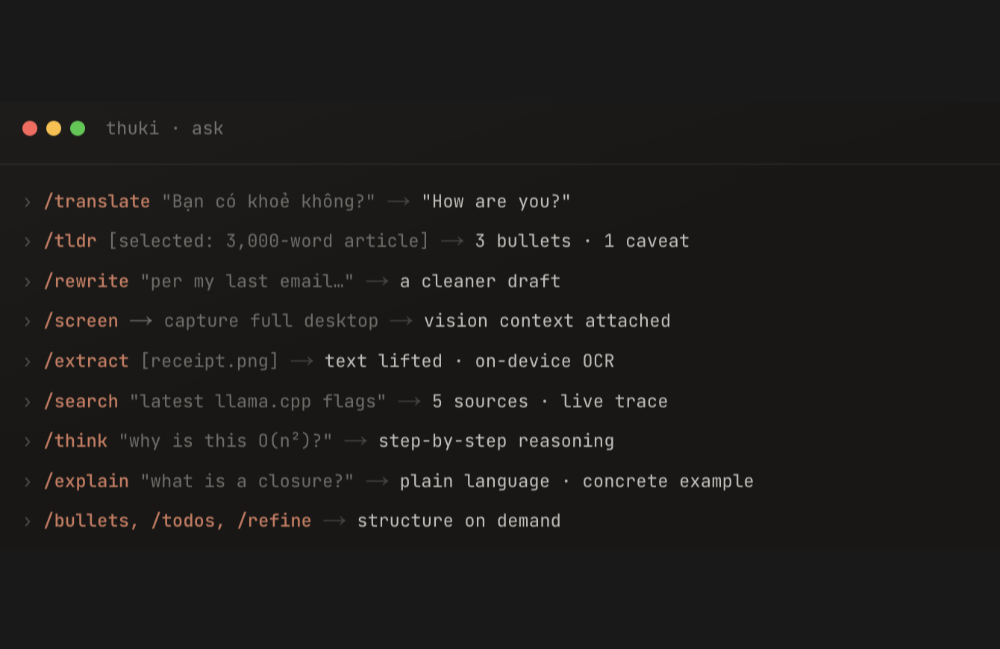

<h1 align="center">
  Thuki
</h1>

<p align="center">
  <a href="https://www.thuki.app/" target="_blank" rel="noopener noreferrer"></a>
</p>

<p align="center">
  A floating AI secretary for macOS. Double-tap Control to summon a spotlight-style overlay anywhere, even over fullscreen apps. It runs entirely on your Mac with its own built-in engine: private, with no cloud and no API keys.
</p>

<p align="center">
  <strong>Free and open source.</strong>
</p>

<p align="center">
  
  <a href="LICENSE"></a>
  <a href="https://www.thuki.app/" target="_blank" rel="noopener noreferrer"></a>
  <a href="https://github.com/quiet-node/thuki/actions/workflows/pr-pipeline.yml"></a>
  
</p>

<p align="center">
<a href="https://www.star-history.com/?repos=quiet-node%2Fthuki">
 <picture>
   <source media="(prefers-color-scheme: dark)" srcset="https://api.star-history.com/chart?repos=quiet-node/thuki&type=date&theme=dark&legend=top-left&sealed_token=RInh4YQ1HML24EmplYPYytSlPk2s9sJSDFcQ9ZImNkZ-PWs_0X8avGjbQR1l5ZS1dleJX4av356gB86_RgFETLYLV7KsRgbemEstuy2AH0lZkEA9aRxjoj2zubkMPUKWzGptoqFqLvNc8HRJXhe5z9AU6G6zI5xUancdFeTo6aiRSSEqquS17wF4I5Tf" />
   <source media="(prefers-color-scheme: light)" srcset="https://api.star-history.com/chart?repos=quiet-node/thuki&type=date&legend=top-left&sealed_token=RInh4YQ1HML24EmplYPYytSlPk2s9sJSDFcQ9ZImNkZ-PWs_0X8avGjbQR1l5ZS1dleJX4av356gB86_RgFETLYLV7KsRgbemEstuy2AH0lZkEA9aRxjoj2zubkMPUKWzGptoqFqLvNc8HRJXhe5z9AU6G6zI5xUancdFeTo6aiRSSEqquS17wF4I5Tf" />
   
 </picture>
</a>
</p>

---

Thuki (thư kí, Vietnamese for secretary) is a lightweight macOS overlay powered by local AI models running entirely on your own machine, built for quick, uninterrupted asks without ever leaving what you're doing.

## Project status

Thuki is in maintenance mode. The app is stable, free, and fully open source, and it keeps doing everything described below.

My focus has moved to other early-stage products, so new feature work has stopped. What continues:

- Reported bugs, crashes, and security issues get triaged and fixed. [Open an issue](https://github.com/quiet-node/thuki/issues).
- Dependency, engine, and macOS compatibility updates keep landing.
- Pull requests are welcome and reviewed.

If Thuki is part of your workflow it will keep working, and the Apache 2.0 license means you are free to fork it and take it further.

## Install on macOS

> **Requirements:** macOS 13.4 (Ventura) or later, Apple Silicon (M1-M5).

```bash
curl -fsSL https://thuki.app/install.sh | sh
```

Downloads the latest `Thuki.dmg` over HTTPS, verifies its RSA-4096 signature with the `openssl` already on your Mac, and installs it to `/Applications`.

Other paths: [inspect the script](docs/install.md#inspect-the-install-script) · [manual DMG](docs/install.md#manual-install-download-the-dmg) · [Nightly](docs/install.md#nightly-side-by-side-with-stable) · [build from source](docs/install.md#build-from-source).

## Why Thuki?

**Most local AI tools are a place you go. Thuki is a key you press.**

- **It arrives knowing what you were looking at.** Highlight text in any app, double-tap Control <kbd>⌃</kbd>, and your selection is already quoted. One gesture, no copy-paste round trip.
- **Nothing to install, pay, or configure first.** Thuki ships its own llama.cpp engine and browses Hugging Face in-app, so any open model is a click away. No terminal, no separate server, no API key, no license fee.
- **It sees your screen, not just your clipboard.** `/screen` attaches your whole desktop as visual context for any vision-capable model.
- **Free and open source, running only on your machine.** No accounts, no per-query cost, no telemetry. Your conversations stay in a local database and nowhere else.
- **Works offline.** Once a model is downloaded, inference needs no connection. Only downloads and web search use the network, and Auto search is one toggle from off.

## Features

<table>
<tr>
<td width="50%"><b>Always one keystroke away</b><br><sub>Double-tap Control from any app, even fullscreen.</sub><br><video src="https://github.com/user-attachments/assets/632d1af8-af83-4c46-8432-713054df8a21"></video></td>
<td width="50%"><b>Highlight, then ask</b><br><sub>Select text, double-tap, it arrives as a quote.</sub><br><video src="https://github.com/user-attachments/assets/1fcb8994-5dbb-42ca-9913-1001e2f1ac15"></video></td>
</tr>
<tr>
<td width="50%"><b>Capture your screen</b><br><sub><code>/screen</code> attaches your whole desktop as context.</sub><br><video src="https://github.com/user-attachments/assets/d2400c9d-d99b-4460-aa7c-9d5322c7236b"></video></td>
<td width="50%"><b>Built-in web search</b><br><sub>Keyless and cited. <code>/search</code> forces a lookup.</sub><br><video src="https://github.com/user-attachments/assets/328d2ae5-5805-4137-b5cc-b895d2375915"></video></td>
</tr>
<tr>
<td width="50%"><b>On-device model library</b><br><sub>Download any GGUF, switch from the ask bar.</sub><br><video src="https://github.com/user-attachments/assets/bfffd639-6145-4893-a221-8cefdaafcb34"></video></td>
<td width="50%"><b>Just a slash, zero menus</b><br><sub>Every task is a verb. No dropdowns, no settings.</sub><br></td>
</tr>
</table>

## Models & providers

Thuki runs models through a provider. The built-in engine is the default; Ollama is there if you'd rather bring your own.

### Built-in engine (default)

A bundled llama.cpp `llama-server` that Thuki spawns, supervises, and shuts down for you. Download GGUF models such as Llama, Gemma, and Qwen from the Hugging Face Hub right inside the app, then switch between them from the ask bar. No accounts, no API keys, no cost per query.

### Other supported providers

Thuki can also run inference through an external provider instead of the built-in engine.

- **Ollama.** Prefer your own [Ollama](https://ollama.com) install? Switch to it anytime from Settings.

See [docs/models-and-providers.md](docs/models-and-providers.md) for the full model library and provider guide.

## Privacy

Inference runs on-device, so your prompts, context, and replies never leave your Mac. There is no Thuki account, no API key, no cloud backend, and no telemetry. Conversation history lives in a local SQLite database on your machine; delete a conversation and it is gone. Outbound network use is limited to model downloads from Hugging Face and web search (Auto search and/or `/search`); both search paths can be turned off or avoided. See [docs/privacy.md](docs/privacy.md).

## Architecture & security

Tauri v2 (Rust backend, React and TypeScript frontend) with a bundled llama.cpp `llama-server` engine bound to `127.0.0.1` and killed on quit. The pinned engine release is sha256-verified at build time and every model download is checked against a pinned Hugging Face revision. See [docs/models-and-providers.md](docs/models-and-providers.md) for engine internals and [SECURITY.md](SECURITY.md) for the full security posture.

## Configuration

Thuki works on sensible defaults out of the box. Tweak anything from the in-app Settings panel (open it from the menu-bar icon) or by editing the TOML file at `~/Library/Application Support/com.quietnode.thuki/config.toml`; both write to the same place.

See [docs/configurations.md](docs/configurations.md) for the full schema, [docs/commands.md](docs/commands.md) for the slash command reference, [docs/built-in-web-search.md](docs/built-in-web-search.md) for the built-in search design handbook, and [docs/troubleshooting.md](docs/troubleshooting.md) when something goes wrong.

## Contributing

Contributions are welcome! Read [CONTRIBUTING.md](CONTRIBUTING.md) to get started, and follow the [Code of Conduct](CODE_OF_CONDUCT.md).

Community-maintained Windows ports: [ThukiWin](https://github.com/ayzekhdawy/thukiwin) and [Mate](https://github.com/M31i55a/windowsMate-Thuki).

## License

Copyright 2026 Logan Nguyen. Licensed under the [Apache License, Version 2.0](LICENSE).
