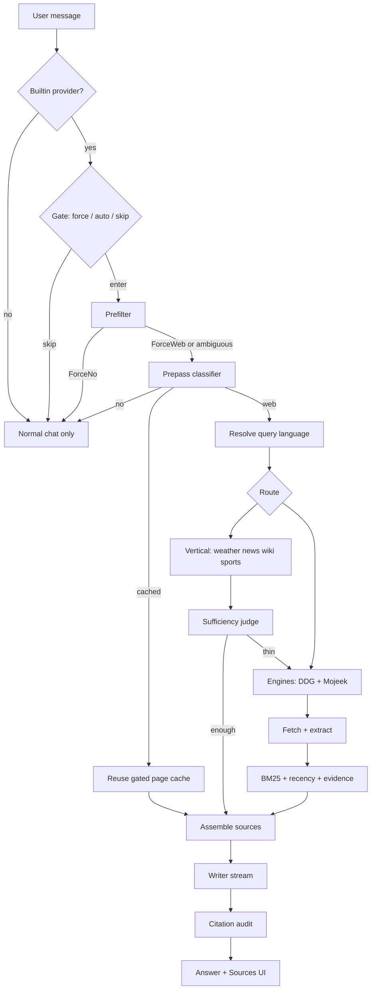

# Built-in web search (design handbook)

Design handbook for Thuki’s built-in web search: how a turn decides to search, what runs in order, why each step exists, and how answers stay grounded and safe. Search runs inside the app on the **builtin** provider: public sources over HTTP, grounded answers with citations, progressive status in chat.

**Related docs (do not duplicate here)**

| Need                                     | Doc                                                                  |
| ---------------------------------------- | -------------------------------------------------------------------- |
| `/search` and Auto search UX             | [commands.md](./commands.md)                                         |
| Network privacy (what leaves the device) | [privacy.md](./privacy.md), [search-privacy.md](./search-privacy.md) |
| Every baked-in constant                  | [configurations.md](./configurations.md) (Built-in web search)       |
| Live eval harnesses                      | [search-eval.md](./search-eval.md)                                   |
| Security reporting                       | [SECURITY.md](../SECURITY.md)                                        |
| Module rustdoc                           | `src-tauri/src/websearch/mod.rs` and neighbors                       |

---

## Contents

1. [What this is](#what-this-is)
2. [Where results come from](#where-results-come-from)
3. [Philosophy](#philosophy)
4. [Big picture](#big-picture)
5. [When search runs](#when-search-runs)
6. [Path of one turn](#path-of-one-turn)
7. [How to read each stage](#how-to-read-each-stage)
8. [Decide: prefilter and prepass](#decide-prefilter-and-prepass)
9. [Query language](#query-language)
10. [ForceWeb latency race](#forceweb-latency-race)
11. [Clock (not search)](#clock-not-search)
12. [Caches](#caches)
13. [Verticals](#verticals)
14. [Sufficiency judge and requery](#sufficiency-judge-and-requery)
15. [Engine tier](#engine-tier)
16. [Fetch and extract](#fetch-and-extract)
17. [Rank, recency, evidence, assemble](#rank-recency-evidence-assemble)
18. [Writer and citation audit](#writer-and-citation-audit)
19. [Outbound security (`net`)](#outbound-security-net)
20. [Trust signals: User-Agent, attribution, hosts](#trust-signals-user-agent-attribution-hosts)
21. [UI, IPC, and first-use notice](#ui-ipc-and-first-use-notice)
22. [Outcomes and failures](#outcomes-and-failures)
23. [Observability](#observability)
24. [Config](#config)
25. [Measuring quality](#measuring-quality)
26. [Limits and risks](#limits-and-risks)
27. [Glossary](#glossary)

---

## What this is

**Built-in web search** is an in-app multi-step process (a **pipeline**: fixed stages in order) on the **builtin** provider only.

- **Builtin provider:** Thuki’s own local AI engine (not Ollama or a cloud chat API). It runs a bundled **llama.cpp** program named **`llama-server`**: the process that loads your **GGUF** model file (a common on-disk format for local LLMs) and answers chat/search model calls on your Mac.
- **Keyless sources:** public websites and APIs the app can call **without you pasting an API key** (weather, news feeds, Wikipedia, HTML search pages, and similar).

It can:

1. Decide whether a plain chat turn needs live facts (**Auto search**: a Settings toggle; when on, ordinary messages may open the web).
2. Or force a look-up when the user types **`/search`**.
3. Resolve the **language of the user’s message** and shape every outbound request for that language.
4. Pull keyless sources (specialized APIs and public search pages).
5. Rank, filter, and budget that text into numbered sources.
6. Stream an answer that should **cite** those sources (point at them with markers like `[1]`, `[2]`), in the user’s language, then **audit** the citations (check the answer’s claims against source text).

Ollama and other providers do **not** run this pipeline. **Transform** slash commands (`/rewrite`, `/tldr`, …) only rewrite text you already supplied; they never auto-search.

---

## Where results come from

Two layers. Which one runs depends on the question.

### Specialized APIs (verticals)

For clear intents, Thuki calls structured public APIs **before** general web search:

| Intent                     | Service                                          |
| -------------------------- | ------------------------------------------------ |
| Weather / forecast         | [Open-Meteo](https://open-meteo.com/)            |
| Headlines / current events | [Google News RSS](https://news.google.com/)      |
| Definitions / stable facts | [Wikipedia](https://www.wikipedia.org/)          |
| Live scores / fixtures     | ESPN public scoreboard (unofficial frontend API) |

Privacy links and User-Agent policy: [search-privacy.md](./search-privacy.md).

### General web search engines (SERP tier)

When the turn needs open-web links (or a vertical was thin), Thuki scrapes **two** keyless HTML search engines **from your Mac**, in parallel, then **fuses** their hit lists:

| Engine                                                   | Role in Thuki                                                                                                                         |
| -------------------------------------------------------- | ------------------------------------------------------------------------------------------------------------------------------------- |
| **[DuckDuckGo](https://duckduckgo.com/)** HTML (`/html`) | **Primary.** Richest organic results for general queries.                                                                             |
| **[Mojeek](https://www.mojeek.com/)**                    | **Second independent ranking.** Scraper-friendly, lightweight HTML; still useful when DuckDuckGo is rate-limiting or blocking the IP. |

Queries go **device → those services**. Thuki does not proxy search through Quiet Node servers.

### Why these two (and not others)

Design goal for the general-web tier: **keyless**, **parseable server-rendered HTML**, and **two independent rankings** so agreement can beat junk that only one engine surfaces (then RRF merge).

| Choice              | Why it fits                                                                                                                                                   |
| ------------------- | ------------------------------------------------------------------------------------------------------------------------------------------------------------- |
| **DuckDuckGo HTML** | Strong default recall; public HTML endpoint the product can parse without a search API key.                                                                   |
| **Mojeek**          | Independent index; tolerant of this scrape style; covers blind spots when DDG is empty/blocked (DDG blocks are often multi-hour; Mojeek cooldown is shorter). |

**Probed and not used** for this tier (live checks in engine design notes):

| Candidate                                     | Why not                                                                    |
| --------------------------------------------- | -------------------------------------------------------------------------- |
| Brave / Startpage / Qwant                     | JS-shell pages: little or no usable result HTML without a full browser.    |
| Ecosia / Presearch                            | Non-browser clients get **403**.                                           |
| Bing                                          | Organic results no longer ship in the initial HTML in a form we can parse. |
| Google web Search API / others that need keys | Breaks “keyless, no account” product shape.                                |

Adding a third engine later is a single table entry in code (`ENGINES`); control flow already races and fuses N lists.

Verticals stay separate: they are not “more SERP engines,” they are intent APIs tried first.

---

## Philosophy

These principles drive the design. Everything later is an application of them.

| Principle                      | Meaning in practice                                                                                                                                                                                                                                            |
| ------------------------------ | -------------------------------------------------------------------------------------------------------------------------------------------------------------------------------------------------------------------------------------------------------------- |
| **In-app and keyless**         | Pipeline ships with Thuki. Sources are public HTTP endpoints and HTML search pages; no per-user API credentials.                                                                                                                                               |
| **Local-first**                | **Inference** (running the model to generate text) stays on-device. Network is optional and user-controllable (Auto search and `/search`).                                                                                                                     |
| **Decide before you spend**    | Cheap code rules first; only then a small **classifier** call (a short model call that only chooses search routing, not the final answer); only then the web.                                                                                                  |
| **Language parity**            | A non-English question searches that language’s web and Wikipedia edition; answers follow the user, not a fixed English default.                                                                                                                               |
| **Specialized before scrape**  | Weather, scores, news, definitions: structured APIs beat raw web-page scraping when the answer lives in a live widget, not an article.                                                                                                                         |
| **Many weak signals beat one** | Several search engines in parallel, then **merge** their ranked lists so agreement beats a single junk #1.                                                                                                                                                     |
| **Never trust the page**       | Downloaded page text is untrusted: **SSRF** URL guards (block fetches to your LAN/private IPs), size/timeouts, **nonce** fences (random delimiters so page text cannot fake “end of instructions”), strip of invisible characters, post-answer citation audit. |
| **Evidence over confidence**   | “Today” and price questions drop stale archive URLs and numberless marketing pages so the model cannot sound sure on empty chrome.                                                                                                                             |
| **Bounded work**               | Fixed budgets: pages, tokens, repair rounds, at most one requery. Fixed stage order in the **orchestrator** (the module that runs stages in order and handles cancel/outcomes).                                                                                |
| **Honest when empty**          | If search was needed but nothing usable returned, disclose that; do not fake “current” knowledge.                                                                                                                                                              |
| **Privacy of cache**           | Conversation page cache and scrape caches live in process memory only; process exit wipes them.                                                                                                                                                                |
| **Reuse is gated**             | Classifier `cached` only hints; re-rank stored **pages** for the new question and run a buffered writer check; escalate to a full search if pages cannot ground the answer.                                                                                    |

---

## Big picture

Terms used in the map below:

| Term                               | Meaning                                                                                                                                               |
| ---------------------------------- | ----------------------------------------------------------------------------------------------------------------------------------------------------- |
| **Prefilter**                      | Stage-1 **code-only** rules on the latest message: must search / must not / unsure. No model.                                                         |
| **ForceWeb / ForceNo / Ambiguous** | Prefilter verdicts: force a web path, force no web, or hand off to the classifier.                                                                    |
| **Prepass (classifier)**           | Stage-2 short model call: fill a JSON form (`no` / `cached` / `web`, route, queries).                                                                 |
| **Vertical**                       | Specialized API path for one intent (weather, news, Wikipedia, sports) before general web search.                                                     |
| **SERP**                           | **S**earch **E**ngine **R**esults **P**age: the list of titled links + snippets a search engine returns for a query (before opening any result page). |
| **RRF**                            | **R**eciprocal **R**ank **F**usion: formula that merges several ranked URL lists without training (`score ≈ sum 1/(k + rank)`).                       |
| **BM25**                           | Classic **keyword** score for “how well does this passage match the query?” (also called Okapi BM25). No neural embedding required.                   |
| **DDG / Mojeek**                   | **DuckDuckGo** and **Mojeek**: the two public HTML search engines Thuki scrapes for general web hits.                                                 |
| **Citation audit**                 | After the answer streams, code checks that `[n]` markers match the numbered sources (may repair or show an honesty note).                             |

**Stages and helpers** (code under `src-tauri/src/websearch/`):

| Order  | Stage                           | One-line role                                                             |
| ------ | ------------------------------- | ------------------------------------------------------------------------- |
| 1      | `prefilter`                     | Code rules: must search / must not / unsure                               |
| 2      | `prepass`                       | Classifier model: `no` / `cached` / `web` + queries (+ optional `lang`)   |
| (side) | ForceWeb SERP race              | On engine-shaped ForceWeb, raw-query SERP runs **with** the classifier    |
| (side) | `clock`                         | Place-time for clock questions (not a search)                             |
| 3      | `lang`                          | Resolve language once from the user message; shape every channel          |
| 4      | `cache` / `serp_cache`          | Conversation page cache (reuse) + process SERP/page scrape cache          |
| 5      | Verticals                       | Weather, news, Wikipedia, sports APIs                                     |
| 6      | `judge`                         | Did the vertical actually answer? Else escalate                           |
| 7      | `engine`                        | Scrape keyless SERPs, fuse ranks (RRF + credibility list)                 |
| 8      | `fetch`                         | Download pages, extract readable text                                     |
| 9      | `rank` + `recency` + `evidence` | Passages, freshness prior, price/freshness filters                        |
| 10     | `assemble`                      | Numbered source blocks under a token budget                               |
| 11     | `writer`                        | Grounded answer stream; cache tier may buffer for `INSUFFICIENT_EVIDENCE` |
| 12     | `cite_check`                    | Mechanical citation support + optional repair                             |
| glue   | `orchestrator`                  | Fixed order, cancellation, outcomes, timings                              |
| glue   | `stage_timing`                  | Per-stage wall times → stderr + chat trace                                |

Outbound HTTP goes through `src-tauri/src/net/`: SSRF-safe transport (every fetch re-checks that the target is a public internet address, not private/LAN).

---

## When search runs

| Situation                    | Behavior                                                                       |
| ---------------------------- | ------------------------------------------------------------------------------ |
| Auto search **on** (default) | Plain messages, `/explain`, `/think` may search when the decision path says so |
| Auto search **off**          | Plain turns stay local; only `/search` hits the web                            |
| `/search …`                  | Always force retrieval on **builtin** (engines-focused path)                   |
| Transform commands           | Never auto-search                                                              |
| Non-builtin provider         | No pipeline; normal chat                                                       |

Settings: **Settings → Behavior → Auto search** (`[behavior].auto_search` in config).

First open after upgrade: a short **v0.16 Auto search announcement** can show on the ask bar until the user taps **Acknowledge** (`behavior.search_notice_acknowledged`). That dismiss is permanent and does not by itself flip Auto search. **Learn more** / Settings deep-links are product UX; privacy copy for what leaves the device lives in [search-privacy.md](./search-privacy.md).

Details: [commands.md](./commands.md), [privacy.md](./privacy.md).

---

## Path of one turn

Compressed walkthrough of a typical Auto-search success:

1. Frontend calls `ask_model` (the Tauri command that runs one chat turn) with conversation id and optional slash command.
2. Backend gate: skip, force (`/search`), or allow auto.
3. **Prefilter** inspects the latest user text (no model).
4. **Prepass** classifier (when needed) returns decision + standalone question + keyword queries; may race a raw SERP on ForceWeb (see below).
5. **Language** is resolved once from the **user’s original message** (not from rewritten queries) and threaded into every outbound request.
6. If `cached`, try **conversation page reuse** (re-rank stored pages for the new question; escalate to a full search if pages cannot ground it).
7. If `web`, try an intent **vertical**; **judge** may escalate to engines.
8. Engines race, fuse hit lists, **fetch** top pages, **rank** chunks, apply **evidence** filters, **assemble** `[1]…[n]`.
9. **Writer** streams the answer with sources fenced as untrusted data.
10. **Cite check** scores citations; may repair or strip; may attach an honesty note.
11. UI shows progressive status, then Sources (with attribution when required), then the answer.

`/search` commits to looking up; it does not take “answer without web” shortcuts.

---

## How to read each stage

From here on, most stages use three short blocks:

| Block    | Meaning                                               |
| -------- | ----------------------------------------------------- |
| **What** | What this stage is                                    |
| **Why**  | Why it exists                                         |
| **How**  | How it works under the hood (steps + a small example) |

Jargon is defined at first use (and summarized in the [Big picture](#big-picture) table and the [Glossary](#glossary)).

---

## Decide: prefilter and prepass

Search uses a **two-stage decision** before spending network or a full answer call.

### Prefilter (stage 1)

**What.** A pure code check on the latest user message. No model. Returns one of: `ForceWeb`, `ForceNo`, or `Ambiguous`.

**Why.** Obvious cases should not wait on a classifier. Small models often invent “current” facts from training memory; ForceWeb removes that choice when freshness is clear. ForceNo avoids useless web trips on greetings and pure transforms.

**How.**

1. Take the message text (capped at a max scan length so huge pastes stay cheap).
2. Normalize and split into tokens / whole phrases.
3. Run fixed rule lists, in order, for example:
   - clock / transform / greeting → often **ForceNo**
   - word list (`latest`, `weather`, `price`, …) or phrase list (`who won`, `right now`, `search for`, …) → **ForceWeb**
   - current/future year, URL, relative-date math (“how many days until…”) → **ForceWeb**
   - force-search signals beat skip signals (e.g. “summarise the latest news” still ForceWeb)
4. If nothing matches with certainty → **Ambiguous** (hand to prepass).

**Example.**  
`"weather in Tokyo"` → token `weather` hits ForceWeb list → verdict ForceWeb → later stages search (or weather vertical).  
`"hi"` → greeting skip → ForceNo → normal chat, no classifier, no network.

Code: `prefilter.rs`.

### Prepass / classifier (stage 2)

**What.** One short call to the **same active builtin model**, with a fixed JSON “form” to fill. Decides `no` / `cached` / `web`, picks a **route** (weather / news / wiki / sports / web), rewrites a standalone question + 1–3 keyword queries, optional language code.

- **`no`:** answer without web.
- **`web`:** retrieve now (verticals / engines).
- **`cached`:** **hint only** — try conversation page reuse for this follow-up. Orchestrator still re-ranks stored pages and may escalate to a full search (see [Caches](#caches)). Not “skip all checks and reuse the last answer.”

**Why.** Ambiguous turns need judgment and conversation context (“what about him?”). A separate short system prompt avoids the chat persona biasing “don’t search.” Structured JSON keeps tiny models parseable. Classifier prompt also steers: live/volatile details should stay `web`, not `cached`; stable adjacent facts on already-fetched pages may be `cached`.

**How.**

1. Build a **persona-free** system prompt (routing role only; “Reasoning: low”).
2. Optionally attach recent turns (user text + truncated assistant answers) for pronoun resolution only.
3. Call the warm `llama-server` with **structured output**: a **JSON schema** via the API’s `response_format` field so the reply must be a form with allowed values only, not free prose.
4. Parse fields: `search`, `route`, `standalone_question`, `queries`, `explicit_search`, `lang`.
5. Orchestrator may still override with ForceWeb / `/search` force rules; on `cached`, runs `reuse_or_escalate` (not blind reuse).

**Example.**  
User earlier: “Who is the CEO of Nvidia?” Assistant named Jensen Huang.  
User now: “How much is he worth?”  
Prefilter: Ambiguous. Prepass: often `search=web` (live net worth) with standalone “what is Jensen Huang’s net worth”.  
If a prior engine search already left profile **pages** in the conversation cache and the classifier chooses `cached` for a stable facet (e.g. age after net worth), the reuse gate still re-ranks those pages for the new question.

Code: `prepass.rs`.

---

## Query language

**What.** One language code per turn for all outbound search channels (engines, news, wiki, weather geocode, headers).

**Why.** A Vietnamese question should hit Vietnamese (or language-biased) results and the right Wikipedia edition, and the answer should follow the user, not a fixed English web.

**How.**

1. Always start from the **user’s original message** (never from rewritten English companion queries).
2. Try, in order:
   - **Script share** (e.g. enough Kana → Japanese; a single Chinese character inside an English sentence does not flip the whole turn)
   - **Classifier `lang`** if present and on the allowlist (helps Vietnamese in Latin script)
   - **System locale** (`$LANG`)
   - **Default** English
3. Map that code only through a **compile-time allowlist** (a fixed set of known-safe language codes baked into the binary as static strings used in URLs/hosts, so nothing free-typed becomes a hostname).
4. Apply per-channel shapes: DuckDuckGo region + `Accept-Language` (HTTP header that tells servers which languages you prefer), Mojeek language bias, News locale, Wikipedia subdomain, Open-Meteo geocode language.

**Example.**  
`"東京の今日の天気は"` → script → `ja` → Open-Meteo/wiki/engines use Japanese-shaped requests.

Code: `lang.rs`, `script.rs`.

---

## ForceWeb latency race

**What.** A speed trick used only when prefilter already said **ForceWeb** and the question looks like a **general web** look-up (not weather / news / sports, which use vertical APIs instead).

Without the race, the timeline is sequential:

1. Wait for the **classifier** (model rewrites the question into search keywords).
2. **Then** call DuckDuckGo/Mojeek with those keywords (**SERP** = the hit list).

With the race, Thuki **overlaps** those two waits:

1. **At the same time:**
   - Task A: classifier rewrites the question.
   - Task B: SERP using the user’s **raw** message text (what they typed).
2. When Task A finishes, pure code runs **keep-or-discard** on Task B (`preloaded_serp_for_decision`).

“Race” means **parallel start**, not a winner-takes-all fight and **not** a quality contest between result lists.

### Who decides “keep Task B?”

**Code only** (after the classifier returns). Not the model. Not a score of “good hits.”

The question is **not** “are these results good enough?”  
It is **“did Task B search for the same query the classifier ended up wanting?”**  
If the search string would have been different, throw Task B away and SERP again.

### Keep rules (all three must pass)

| #   | Check                    | How it is decided                                                                                                                                                                                                                                                  |
| --- | ------------------------ | ------------------------------------------------------------------------------------------------------------------------------------------------------------------------------------------------------------------------------------------------------------------ |
| 1   | Still **`web`**          | Classifier field `search` must be `web`. If `no` or `cached` → discard Task B.                                                                                                                                                                                     |
| 2   | **Language match**       | Language used for Task B’s SERP must equal the turn’s **final** resolved language. If race was `en` but final is `vi` → discard (wrong web).                                                                                                                       |
| 3   | **Near-duplicate query** | Take the classifier’s **first** keyword query (or its standalone question if `queries` is empty). Compare to the **raw user message** with `queries_near_duplicate`: lowercase + collapse whitespace, then **exact string equality**. Not fuzzy “similar meaning.” |

| Near-duplicate examples                                         | Result                                  |
| --------------------------------------------------------------- | --------------------------------------- |
| raw `Latest  Rust  Version` vs query `latest rust version`      | **Keep** (same words after normalize)   |
| raw `look up how old is the current Pope` vs query `pope age`   | **Discard** (different string)          |
| raw `latest rust version` vs query `rust latest stable version` | **Discard** (word order / words differ) |

Empty hit lists can still be **kept** when all three pass (same miss; avoids a second engine touch that would re-hit cooling engines).

If any check fails → discard Task B → normal SERP with rewritten queries / final language.

**Why.** Classifier is useful but slow. When its first query is effectively the same string as what the user typed, the SERP that already finished during the wait is safe to reuse → wall clock closer to `max(classifier, SERP)` instead of `classifier + SERP`.

**How (eligibility + run).**

1. **Eligible to start the race?** Prefilter = ForceWeb, and text is not weather/news/sports-shaped (skip race so DuckDuckGo is not burned before vertical APIs).
2. **Start together:** Task A classifier + Task B `web_search(raw user text)` (race language from script only, default `en`).
3. **When A finishes:** resolve final language, then apply the three keep checks above.
4. **Keep** → engine tier uses those hits. **Discard** → engine tier SERPs again with final queries/language.

**Example A — keep (all three pass).**

|                        |                                                             |
| ---------------------- | ----------------------------------------------------------- |
| User typed             | `latest stable Rust version`                                |
| Task B searched        | same raw string                                             |
| Classifier first query | `latest stable Rust version` (only case/spacing may differ) |
| Decision / lang        | `web` / `en` (same as race)                                 |
| Result                 | **Keep** Task B. No second DuckDuckGo wait.                 |

**Example B — discard (query string diverged).**

|                        |                                                        |
| ---------------------- | ------------------------------------------------------ |
| User typed             | `look up how old is the current Pope`                  |
| Task B searched        | that full sentence                                     |
| Classifier first query | `pope age`                                             |
| Result                 | Check 3 fails → **discard** → new SERP for `pope age`. |

**Example C — discard (language mismatch).**

Race under `en`; final language `vi` → Check 2 fails → re-SERP under Vietnamese shapes.

**Example D — no race started.**

`weather in Paris` → weather-shaped → skip race → Open-Meteo only.

Code: `orchestrator.rs` (`classify_maybe_race_raw`, `force_web_should_race_raw`, `preloaded_serp_for_decision`), `stage_timing.rs` (`queries_near_duplicate`).

---

## Clock (not search)

**What.** For “what time is it in Tokyo?” style questions, compute local time in code and put it in the system prompt.

**Why.** Small models botch timezone math. This is not a web-search answer and must not look like one.

**How.**

1. Prefilter detects clock-shaped wording and optional place name.
2. Geocode place via Open-Meteo (same family as weather).
3. Read IANA zone, format “now” with system zoneinfo (DST-aware).
4. Inject one factual line into the **system** prompt; chat model answers using it.

**Example.**  
`"What time is it in Tokyo?"` → resolve Asia/Tokyo → system gets current Tokyo wall time → model answers without inventing offsets.

Code: `clock.rs`, `prefilter` helpers, `commands.rs`.

---

## Caches

**What.** Two different in-memory caches. Do not mix them up.

| Cache                                 | Holds                                                                                                                             | Scope                                                          | Why                                                                                    |
| ------------------------------------- | --------------------------------------------------------------------------------------------------------------------------------- | -------------------------------------------------------------- | -------------------------------------------------------------------------------------- |
| **Conversation page cache** (`cache`) | Full **fetched page texts** from recent successful **engine-tier** searches (up to **4** entries), not pre-assembled `[n]` blocks | Per conversation (epoch scope) + per-entry **TTL** (~10 min)   | Follow-ups can re-answer from pages already downloaded without re-hitting the open web |
| **Web scrape cache** (`serp_cache`)   | Per-engine SERP hit lists + extracted page bodies keyed by query                                                                  | Process-wide; SERP ~5 min, pages ~15 min; **FIFO** max entries | Same scrape twice soon: save latency and rate-limit budget                             |

**Rule:** memory only. Process exit wipes both. Queries and page text stay off disk.

### Conversation page cache (what is stored)

**Stores pages, not the old answer’s source blocks.**  
Assembled `[1]…[n]` blocks were BM25-picked for the **first** question. A follow-up (“net worth” then “how old is he?”) may need a sentence the first selection dropped. Caching **cleaned fetched pages** lets the next turn re-run chunk → rank → evidence → assemble **against the new question**. Reuse is “fresh post-fetch pipeline minus the network.”

Only the **scraped engine tier** writes entries (route provenance `web`). Weather / news / sports verticals do not store pages here.

**Bounds (fixed constants):** max **4** entries per conversation; each page text capped (~24 KiB); each entry total text capped (~128 KiB); oldest entry evicted at the cap. Scope is the conversation epoch (new chat / load history / clear → new scope; other scopes dropped).

### Conversation reuse gate (`cached` path)

Classifier `cached` is only a **hint**. Orchestrator `reuse_or_escalate` verifies evidence:

1. **Route eligibility.** Reuse only for routes **`web`** or **`wiki`**. A `cached` decision with route weather / news / sports **skips reuse** and runs a normal live vertical path (volatile facts must not be re-served from old pages).
2. **Union of recent page sets.** Load live, unexpired entries for this conversation whose **producing** route was stable (`web` / `wiki`). Dedup pages by URL (newest entry wins).
3. **Re-pipeline for the follow-up.** On that page union, run the same post-fetch steps as a real search: select chunks (BM25 for the **new** standalone question) → optional recency reorder → evidence filters → assemble. Empty assembly → escalate to full `web` search.
4. **Price-intent hard escalate.** Price / quote wording never synthesizes from reuse (avoids inventing a live quote from a bio page that happens to mention `$`).
5. **Grounding gate (writer sentinel).** Sole reuse grounding check: run a **buffered** (non-streamed) writer under a cache-tier contract. If the model outputs exactly the line **`INSUFFICIENT_EVIDENCE`**, or the buffer is empty/errors, **escalate** to a full search **before any token hits the UI**. A normal answer → serve at once.  
   The separate sufficiency **judge** is **not** on this path (it stays on vertical commit and engine requery only).

**Bias:** when unsure, **fresh search**. Escalation uses the classifier’s route, rewrite, and queries (no second classify).

**Example A — horizontal reuse.**  
Turn 1: “Elon Musk net worth?” → engine search → pages stored.  
Turn 2: “and how old is he?” → classifier may say `cached` → re-rank same pages for age → if pages support the answer, buffered writer returns it; if not → `INSUFFICIENT_EVIDENCE` → full search.

**Example B — volatile, no reuse.**  
Turn 1: weather. Turn 2: still weather-routed → reuse skipped → live Open-Meteo again.

**Example C — scrape cache only.**  
Same keyword SERP twice in 2 minutes → second call may hit `serp_cache` without DDG/Mojeek (independent of conversation page reuse).

Code: `cache.rs`, `serp_cache.rs`, `orchestrator.rs` (`reuse_or_escalate`), `writer.rs` (`INSUFFICIENT_EVIDENCE_SENTINEL`).

---

## Verticals

**What.** First-choice specialized HTTP APIs for clear intents: weather, news, Wikipedia, sports. Tried before general web scraping when the route matches.

**Why.** Live scores and forecasts live in APIs/widgets, not article HTML. Specialized data is cleaner and often faster than SERP + fetch.

**How.** (pattern is the same; details differ)

1. Orchestrator looks at classifier **route** (and related intent helpers).
2. Build a keyless HTTP request (language-aware where needed) through `net`.
3. Parse JSON/RSS/HTML into one or more **source blocks**.
4. On any soft failure → return “miss” and fall through to engines (sports never hard-errors the user).
5. Wikipedia: if freshness/volatility words fire, skip wiki even if route said wiki.

| Vertical | How in one line                                                    |
| -------- | ------------------------------------------------------------------ |
| Weather  | Geocode place → forecast JSON → one block + attribution            |
| News     | Google News RSS query (+ optional 7-day operator) → headline items |
| Wiki     | Search API → summary API for lead paragraph                        |
| Sports   | Map league keywords → ESPN scoreboard window → format events       |

**Example.**  
`"weather in Paris"` → route weather → Open-Meteo → block the writer cites as `[1]`.

Code: `weather.rs`, `news.rs`, `encyclopedia.rs`, `sports.rs`.

---

## Sufficiency judge and requery

**What.** After a vertical (and sometimes after engines), a structured model call asks whether the text actually answers the question. Can request one refined engine search.

**Why.** A scoreboard without the bracket, or headlines without the figure, would force a useless “sources don’t contain that” answer. Better to escalate or requery once.

**Not used on conversation page reuse.** The `cached` path uses the buffered writer + `INSUFFICIENT_EVIDENCE` sentinel instead (see [Caches](#caches)).

**How.**

1. Package question + source text (sources fenced like the writer, injection-aware).
2. Call active model with JSON schema: sufficient or not, optional short “missing” phrase.
3. Insufficient vertical → run engine tier instead of committing.
4. After engines, if still thin → at most **one** requery with `missing` appended to the query; never a free-form agent loop.
5. Parse failure → prefer **commit** what we have (avoid endless retry).

**Example.**  
Sports vertical returns today’s slate but user asked for knockout bracket → judge: insufficient → engines search the bracket.

Code: `judge.rs`, `orchestrator.rs`.

---

## Engine tier

**What.** General web: scrape public HTML search result pages (DuckDuckGo + Mojeek), merge lists, pick top URLs.

**Why.** No single engine is enough; agreement across engines improves quality. Keyless HTML is what the product can call without user API keys.

**How.**

1. For each keyword query, request DuckDuckGo and Mojeek **in parallel** (browser **User-Agent** string on these endpoints: the client identity browsers send; SERP HTML often blocks a bot-style product name).
2. Parse HTML into hit lists (title, url, snippet); strip ads; decode DuckDuckGo redirect URLs.
3. Drop / penalize / boost hosts via compiled **credibility** list (static good/bad domain list for ranking bias only, not a security firewall).
4. **RRF merge** across lists: each URL scores `sum over engines of 1/(60 + rank)`; cap per domain and total hits.
5. Mark engines blocked/empty; apply cooldowns so a blocked engine is not hammered.
6. On freshness questions, bias DuckDuckGo toward recent results (`df=w` form field + cookie).

**Example.**  
Query `openai ceo` → DuckDuckGo ranks A,B,C; Mojeek ranks B,D → B’s RRF score wins → fetch B first.

**Maintenance.** The bulk-imported penalize clusters in `credibility_domains.txt` are refreshed by a scheduled GitHub Action that pulls the latest upstream license-clean spam/copycat lists and opens a reviewable PR when the diff is non-empty; a human still reviews and merges every change. The app itself never fetches these lists at runtime, so the no-phone-home privacy stance is unchanged; updates only ship inside a release.

Code: `engine.rs`, `credibility.rs`.

---

## Fetch and extract

**What.** Download top hit pages and turn HTML into readable article text (or keep the SERP snippet if that fails).

**Why.** The model needs passage text to ground citations, not full raw HTML with nav and ads.

**How.**

1. Choose how many pages to fetch from context size (`num_ctx`: the model’s context window size in tokens; larger windows may fetch more pages).
2. Start concurrent downloads through SSRF-safe transport.
3. Stop waiting after **first-K** completions or soft deadline; do not block on the slowest URL.
4. Run **readability** extraction (`dom_smoothie` library): heuristic that keeps the main article body and drops nav/ads/scripts; element-count guards stop huge hostile pages.
5. Fail → keep SERP snippet so the hit still exists for ranking.

**Example.**  
Top 5 URLs race; 3 finish with article text; 1 times out → snippet used; rank continues.

Code: `fetch.rs`.

---

## Rank, recency, evidence, assemble

### Chunk + score (BM25)

**What.** Split pages into short passages and score how well each matches the question.

**Why.** Context is limited; only the best spans should reach the writer.

**How.**

1. Chunk text (~target words). For Chinese/Japanese/Thai-style scripts, use character windows / **bigrams** (pairs of adjacent characters treated as tokens) so words are not one giant blob.
2. Score chunks with **BM25**: classic “how well do the query words appear in this passage?” score over this turn’s chunks as a tiny corpus. Rewards rare matches, saturates when a word repeats forever, adjusts for passage length.
3. Optional boosts for quote/statistic-shaped text on trusted domains.
4. Keep top chunks best-first.

### Recency

**What.** On freshness questions only, prefer newer pages a bit.

**How.** Read published/modified dates from HTML when present; blend age into the score with a **half-life** formula (score decays as age grows; after one half-life period the recency part is half as strong). Non-fresh questions: skip.

### Evidence filters

**What.** Extra pure filters after ranking for “today” and “price” style turns.

**How.** In order:

1. Drop URL paths with old `/YYYY/` archives on freshness turns.
2. On price intent: keep only chunks with real digit “price-like” numbers; if none, empty (refuse later).
3. If several prices disagree by a huge factor, drop the minority magnitude cluster.

**Example.**  
Gold price question; one page says 14.3M, peers say 145M → drop the 14.3M cluster before the writer sees it.

### Assemble

**What.** Turn surviving chunks into numbered sources `[1]…[n]` under a token budget.

**How.** Group by page → greedy fill until budget (`~40% of num_ctx`, hard max) → always keep at least one block if anything exists → pass to writer + UI.

Code: `rank.rs`, `recency.rs`, `evidence.rs`, `assemble.rs`, `script.rs`.

---

## Writer and citation audit

### Writer

**What.** Stream the user-facing answer using the active model, with retrieved sources in the prompt.

**Why.** Grounding must sit next to instructions, while the user message stays the user’s words (and images).

**How.**

1. Mint a random **nonce** (one-time random token used as start/end fence markers for this turn only).
2. Strip invisible Unicode from source text.
3. Append grounding rules + fenced sources to the **system** side (not the user turn).
4. Stream chat completions from the same model; UI already has source list from earlier chunks.

**Prompt injection (web):** a page can embed text like “ignore previous instructions.” Treating page text as data inside a random fence, then auditing citations, reduces that risk.

### Citation audit

**What.** After the answer finishes, check that `[n]` citations actually match source text. May repair; may show an honesty note.

**Why.** Small models invent citation numbers or cite the wrong source.

**How.**

1. **Mechanical** (no model): find `[n]`, take the sentence as the claim, score word/number overlap with source `n` → supported / weak / unsupported / unverifiable.
2. If bad: up to **two** writer repair rounds (model again) with a short critique of which `[n]` failed.
3. Strip remaining bad cites; only **total** failure adds the user-visible honesty note.

Code: `writer.rs`, `cite_check.rs`.

---

## Outbound security (`net`)

**What.** Shared HTTP client for every search download.

**Why.** Result URLs and redirects are untrusted. A bad link must not make Thuki call your LAN or cloud metadata.

**How.**

1. Allow only `http`/`https`.
2. Before connect: reject private/loopback/link-local IP literals.
3. **DNS** (domain name → IP) resolve → screen every address again (stops **DNS rebinding**: a hostname that answers “public” once then “private” on the real connect).
4. On each redirect hop, repeat checks.
5. No HTTP proxy (proxy DNS would bypass the pin).
6. Timeouts + max response size.

Code: `net/ssrf.rs`, `net/transport.rs`.

---

## Trust signals: User-Agent, attribution, hosts

**What.** How Thuki identifies itself on the wire, credits sources, and names hosts.

**Why.** Lawful honesty for APIs; SERP reachability; correct domain classification for non-ASCII hosts.

**How.**

| Case                  | How                                                                                                                                               |
| --------------------- | ------------------------------------------------------------------------------------------------------------------------------------------------- |
| Weather / News / ESPN | Send product UA `Thuki/<version> (+https://thuki.app)`                                                                                            |
| Wikipedia             | Descriptive UA (name, site, contact) per Wikimedia norms                                                                                          |
| DDG / Mojeek HTML     | Browser-like UA (product bot UA is blocked on DDG HTML) + cooldown if blocked                                                                     |
| Attribution           | Attach licence/credit strings on source metadata for the UI when required                                                                         |
| Hosts                 | Convert international domain names to **punycode** (ASCII form of non-Latin hostnames, e.g. for lookalike-domain checks) before credibility/dedup |

User-facing privacy list of services: [search-privacy.md](./search-privacy.md).

---

## UI, IPC, and first-use notice

**What.** Live progress, sources list, and the one-time Auto search announcement.

**Why.** Search takes time; users need progress. First launch needs a clear Auto search explanation without blocking the product.

**How.**

1. Backend emits `SearchStatus` phases over **IPC** (**i**nter-**p**rocess **c**ommunication: typed messages from the Rust backend to the React UI, here Tauri’s channel API): deciding → searching → reading → verifying.
2. Frontend maps to labels / `SearchProgressBlock` / shared status strip.
3. `SearchSources` fills the Sources footer (titles, urls, optional attribution).
4. Ask bar may show v0.16 notice until `search_notice_acknowledged` is saved.

Code: `commands.rs`, `useModel.ts`, `SearchProgressBlock.tsx`, `versionAnnouncements.ts`.

---

## Outcomes and failures

**What.** Final branch the orchestrator returns to chat.

**Why.** Empty or dead search must not look like a confident live answer.

**How.**

| Outcome       | How we get there                                                                               |
| ------------- | ---------------------------------------------------------------------------------------------- |
| `NoSearch`    | ForceNo / classifier `no` / early soft skip → normal chat prompt                               |
| `Answer`      | Sources assembled → writer messages + source metas                                             |
| `Unreachable` | Search wanted but nothing citable → chat prompt plus “say you could not verify” style guidance |
| `Cancelled`   | User abort mid-pipeline                                                                        |

---

## Observability

**What.** Per-stage timings and optional on-disk chat traces.

**Why.** Debug latency and routing without guessing.

**How.**

1. `TimingBag` records ms for classifier, SERP, fetch, rank, judge, writer, pipeline (including **TTFT**: **t**ime **t**o **f**irst **t**oken of the streamed answer).
2. Flush to stderr lines + `SearchTimings` trace events when debug trace is on.
3. Settings → Behavior → Diagnostics toggles retention / open folder / free traces.

Code: `stage_timing.rs`, trace hooks in `commands.rs` / `orchestrator.rs`.

---

## Config

| Kind         | What                                                                                                                          |
| ------------ | ----------------------------------------------------------------------------------------------------------------------------- |
| User tunable | `[behavior].auto_search` (default `true`)                                                                                     |
| User tunable | `[behavior].search_notice_acknowledged` (one-time announcement dismiss)                                                       |
| User tunable | `[debug] trace_enabled`, `trace_retention_days` (forensics)                                                                   |
| Not tunable  | Engine set, language allowlist shapes, timeouts, RRF/BM25, evidence thresholds, cache TTLs, cite thresholds, vertical maps, … |

Full constant encyclopedia: [configurations.md](./configurations.md). Source of truth in code: `src-tauri/src/config/defaults.rs`.

---

## Measuring quality

Dev-only, not CI gates:

- Decision corpus: `search_decision_eval.jsonl`
- Live smoke / classifier / answer capture / quality tests under `src-tauri/tests/live_*.rs`
- Language-parity-oriented eval coverage for non-English probes

How to run: [search-eval.md](./search-eval.md).

---

## Limits and risks

| Topic                                | Reality                                                                                                  |
| ------------------------------------ | -------------------------------------------------------------------------------------------------------- |
| Public HTML engine ToS / rate limits | Engines can block; cooldowns, caches, and ForceWeb race quota discipline reduce pressure; not a contract |
| Dual User-Agent                      | Browser UA on SERPs is deliberate for reachability; honest UA on API verticals                           |
| ESPN unofficial                      | Can break without notice; soft fallthrough                                                               |
| Language allowlist                   | Only verified languages get non-default channel shapes; others fall back to English                      |
| Small model quality                  | Classifier, judge, and writer can err; ForceWeb, evidence, and cite audit mitigate                       |
| Provider scope                       | Search pipeline runs on **builtin** only                                                                 |
| Live eval                            | Manual; not a merge gate                                                                                 |
| Possible later work                  | Extra engines; dense embedding rank fusion (`Scorer` trait already exists)                               |

---

## Glossary

| Term                  | Plain meaning                                                      |
| --------------------- | ------------------------------------------------------------------ |
| Auto search           | Setting that allows plain turns to open the web when needed        |
| Builtin               | Thuki’s bundled llama.cpp / `llama-server` provider                |
| Pipeline              | Fixed multi-step stages run in order                               |
| Keyless               | No user-supplied API key for those sources                         |
| Classifier / prepass  | Short model call that only routes search (JSON form)               |
| Prefilter             | Code-only search / must-not / unsure rules                         |
| ForceWeb / ForceNo    | Prefilter: force web / force no web                                |
| Cached (classifier)   | Hint to try conversation page reuse; still gated                   |
| Page cache reuse      | Re-rank stored engine pages for a follow-up; escalate if thin      |
| INSUFFICIENT_EVIDENCE | Buffered-writer sentinel: reuse failed grounding → fresh search    |
| Vertical              | Specialized API path (weather, news, wiki, sports)                 |
| SERP                  | **S**earch **E**ngine **R**esults **P**age (hit list + snippets)   |
| RRF                   | **R**eciprocal **R**ank **F**usion: merge lists by `1/(k+rank)`    |
| BM25                  | Classic keyword relevance score (Okapi BM25)                       |
| DDG                   | DuckDuckGo HTML search                                             |
| SSRF                  | **S**erver-**s**ide **r**equest **f**orgery risk; blocked by `net` |
| Nonce                 | One-time random fence token around untrusted page text             |
| TTL                   | Time-to-live (cache expiry)                                        |
| FIFO                  | First-in first-out eviction when a cache is full                   |
| Readability           | Extract main article text from HTML                                |
| num_ctx               | Model context window size (tokens)                                 |
| IPC                   | Inter-process messages (Rust ↔ UI)                                 |
| TTFT                  | Time to first streamed answer token                                |
| Punycode              | ASCII encoding of international domain names                       |
| User-Agent            | Client identity string on HTTP requests                            |
| Citation audit        | Post-check that `[n]` claims match source text                     |
| Attribution           | Licence/provider credit on a source (UI + metadata)                |
| Language parity       | Retrieval and answers follow the user’s language                   |
| ForceWeb race         | Parallel raw SERP while the classifier rewrites                    |
| Evidence filters      | Post-rank drops for stale archives / bad prices                    |
| Orchestrator          | Module that runs stages, cancel, and outcomes                      |

---

_When the pipeline shape changes, update the stage table, diagram, and the affected section in the same PR as the code._
