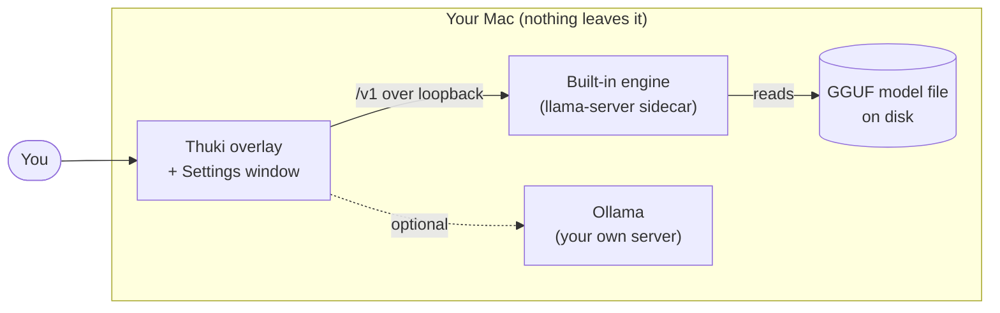
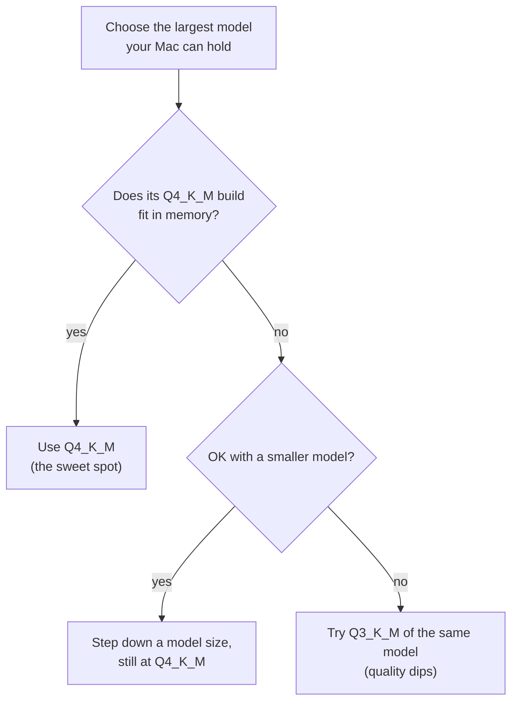
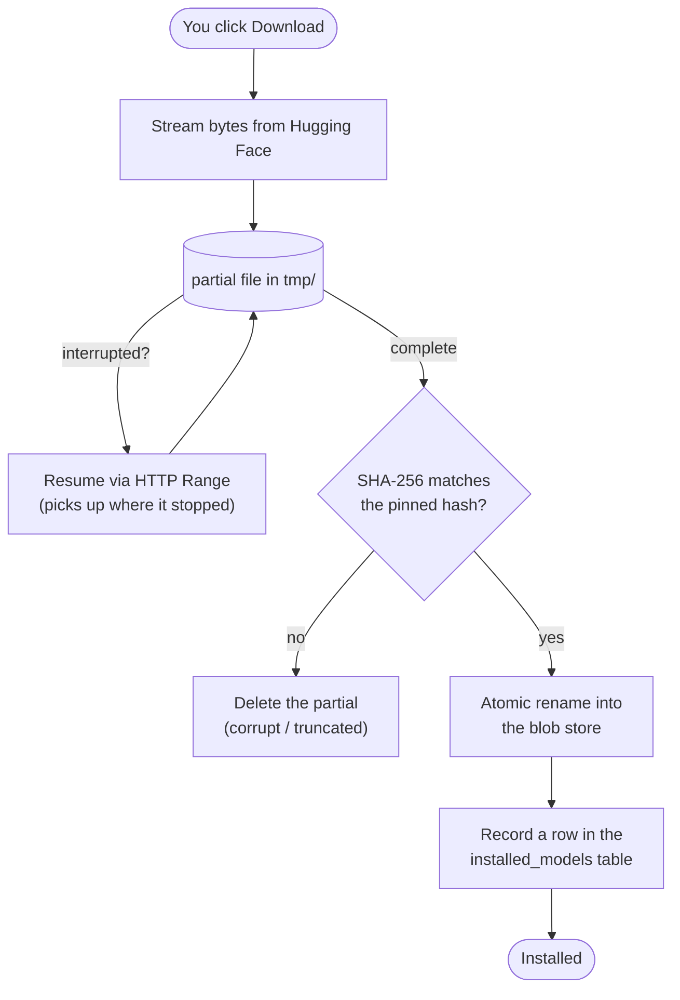
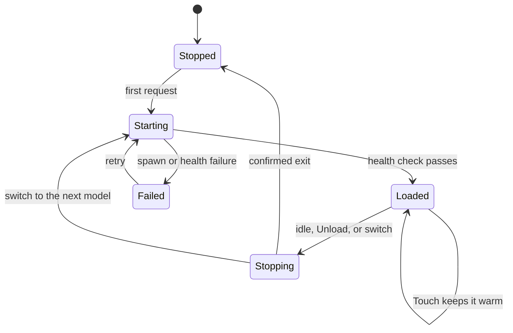
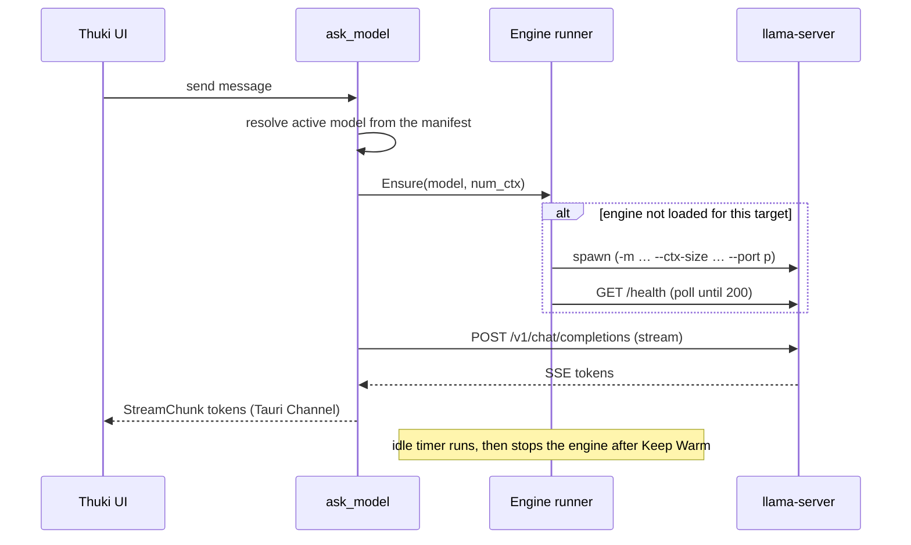

# Models and Providers

A deep dive into how Thuki runs AI on your Mac: the built-in engine, what powers it, what a model actually is, where models live, and exactly how the inference server starts, runs, and stops. If you just want to download a model and chat, the short version is "open Settings, pick a model in Discover, done." Everything below is for when you want to understand what is happening under the hood.

> macOS 13.4 (Ventura) or later, Apple Silicon (M1/M2/M3/M4/M5). See [thuki.app](https://www.thuki.app/) for downloads.

## Contents

- [The big picture](#the-big-picture)
- [The built-in engine](#the-built-in-engine)
- [What a model is (and the words around it)](#what-a-model-is-and-the-words-around-it)
- [Will it fit? The RAM-fit hint](#will-it-fit-the-ram-fit-hint)
- [Getting a model: download, verify, install](#getting-a-model-download-verify-install)
- [Where models live on disk](#where-models-live-on-disk)
- [Running inference: the sidecar](#running-inference-the-sidecar)
- [A chat request, end to end](#a-chat-request-end-to-end)
- [How the engine binary is packaged](#how-the-engine-binary-is-packaged)
- [Settings → Models](#settings--models)
- [Providers: built-in vs Ollama](#providers-built-in-vs-ollama)

## The big picture

Thuki ships its own inference engine and runs it entirely on your machine. Nothing about a chat leaves your Mac. The app you interact with (the overlay and the Settings window) talks to a small local server that loads a model and generates text. That local server is the **built-in engine**.



Thuki supports two **providers** (the thing that runs the model): the **built-in** engine (the default, fully managed by Thuki) and **Ollama** (your own install, optional). Both run llama.cpp under the hood; the difference is who manages it. The rest of this guide is mostly about the built-in engine.

## The built-in engine

The built-in engine is a bundled copy of **llama.cpp's `llama-server`**.

- **llama.cpp** is the widely used open-source C/C++ engine for running LLMs efficiently on consumer hardware, including Apple Silicon (it uses Metal for GPU acceleration). It is the same engine that powers Ollama, LM Studio, and most local-AI apps.
- **`llama-server`** is the HTTP server binary that ships with llama.cpp. You give it a model file, and it exposes an **OpenAI-compatible `/v1` API** over a local port. Thuki sends it standard `/v1/chat/completions` requests and streams the response back token by token.

Thuki bundles this binary so there is nothing for you to install: the engine is already inside the app. (Ollama is the same idea, just managed by Ollama instead of Thuki.)

## What a model is (and the words around it)

A few terms show up constantly. Here is what each one means.

### Weights

A model is a large pile of numbers called **weights**, the trained "knowledge" learned during training. Running the model ("inference") means feeding your text through those weights to predict the next token. Bigger models have more weights, are smarter, and need more memory.

### GGUF

**GGUF** is the single-file format llama.cpp uses to store a model. One `.gguf` file bundles everything the engine needs:

- the quantized **weights**,
- the **tokenizer** (how text is split into tokens),
- **metadata**: the model architecture, its trained context length, its **chat template**, and capability hints.

Thuki reads that metadata directly from the file (with a bounded, panic-safe parser) to classify each model's capabilities, for example whether it reasons, before you ever run it.

### Hugging Face

**Hugging Face** is the public hub where the community publishes models. A model lives in a **repo** (for example `bartowski/Qwen3.5-9B-GGUF`), and a repo can hold several GGUF files (different quantizations of the same model). Thuki's curated picks each pin a repo at an **exact git revision**, so "the same model" always means the same bytes, not whatever the repo happens to contain today.

### Quantization

A model is trained in 16-bit floating point, so each of its billions of weights takes two bytes. That makes the raw model huge. **Quantization** stores those weights with fewer bits each: the weights are split into small blocks, and each block records a low-bit integer per weight plus a scale (and sometimes an offset) to map it back to a real value. Dropping from 16 bits to about 4 bits per weight shrinks the file roughly 4x, so the model loads faster, uses far less memory, and runs faster, at a measurable but usually small cost to quality.

This is why one model on Hugging Face ships as many GGUF files: each is the same weights at a different bit budget, a different point on the size-versus-quality curve.

**Why it barely hurts.** Large models are redundant and tolerant of noise, so rounding each weight a little rarely changes the predicted next token. Modern formats push this further by spending more bits on the tensors that matter most (attention and key projections) and fewer on the rest.

**Decoding the name.** A name like `Q4_K_M` packs three facts:

- **`Q4`** is roughly **4 bits per weight**, the headline size. A higher number means a bigger, better file.
- **`K`** means a **k-quant**, llama.cpp's modern block format that allocates precision intelligently. The older `Q4_0` and `Q4_1` are "legacy" quants (one scale per block, plus an offset for `_1`): simpler and slightly worse per bit. Prefer the `_K` form when it exists.
- **`M`** is the size variant: **S**mall, **M**edium, or **L**arge. It sets how many important tensors are kept at higher precision. `M` is the balanced default, `S` is leaner, `L` keeps more high precision.

You may also see **i-quants** like `IQ4_XS` or `IQ2_M`: an "importance-matrix" format that fits more quality into very small sizes using calibration data. They are great for squeezing a big model into tight memory, but can run slower on some hardware.

| Quant          | ~bits/weight | Quality                                 | When to reach for it                        |
| -------------- | ------------ | --------------------------------------- | ------------------------------------------- |
| `Q8_0`         | 8            | Essentially identical to full precision | Memory to spare, want maximum fidelity      |
| `Q6_K`         | 6.6          | Near-lossless                           | High quality with real savings              |
| `Q5_K_M`       | 5.7          | Near-lossless                           | A small step down from Q6                   |
| `Q4_K_M`       | 4.8          | Small, rarely-noticed loss              | **The default sweet spot for most Macs**    |
| `Q3_K_M`       | 3.9          | Noticeably weaker                       | When Q4 will not fit                        |
| `Q2_K` / `IQ2` | 2.6 to 3.4   | Significant loss                        | Only to run a model you otherwise could not |

**How much memory it needs.** A quick estimate for the weights alone:

```
weights size ≈ parameters × bits-per-weight ÷ 8
```

An 8B-parameter model is about 16 GB at full precision, and roughly:

| Quant    | 8B weights |
| -------- | ---------- |
| `Q8_0`   | ~8.5 GB    |
| `Q5_K_M` | ~5.7 GB    |
| `Q4_K_M` | ~4.9 GB    |
| `Q3_K_M` | ~4.0 GB    |

On top of the weights you also pay for the **KV cache** (which grows with the context window) and a couple of GB of runtime overhead. Thuki folds all of this into the **RAM-fit hint** on each model in Library and Discover, so you do not have to compute it. For the context side of memory, see [Tuning the Context Window](./tuning-context-window.md).

**Quality, concretely.** Quality is usually measured by **perplexity** (lower is better at predicting text), and it rises gently as bits fall. `Q8`, `Q6`, and `Q5` are effectively indistinguishable from full precision; `Q4_K_M` adds a small, rarely-noticed increase; `Q3` is visibly weaker; `Q2` degrades enough to be worth it only for very large models. A useful rule of thumb: **a bigger model at a lower quant usually beats a smaller model at a higher quant, down to about Q4.** Below roughly 3 bits, a model can start to feel unreliable.

**How to pick.**



In practice you rarely need to weigh any of this yourself: Discover's **Staff picks** already ship sensible quants (typically `Q4_K_M` or close), and the RAM-fit hint shows what fits. The detail above is for when you paste a specific repo in **Browse all** and want to choose the right file by hand.

### mmproj (vision)

A vision model needs a second file, the **multimodal projector** (`mmproj`), that turns an image into something the model can read. Thuki downloads it alongside the main model and passes it to the engine with `--mmproj`. Models with this companion show a **Vision** badge.

### Capabilities

Every model in Library and Discover carries up to three small badges. **Text** is always shown (everything Thuki lists is a chat model); **Vision** and **Reasoning** appear only when the model has them:

- **Text**: chats in plain text. Always present.
- **Reasoning**: thinks before answering, in a separate reasoning pass. Turn it on per message with `/think`; a few models always reason and cannot turn it off.
- **Vision**: accepts images (it ships an `mmproj` companion, see [mmproj (vision)](#mmproj-vision)).

Each model also reports its trained **context window** (how many tokens it can see at once).

#### How the badges are decided

For a **Staff pick** the answer is baked in: the curated catalog records each model's capabilities by hand, so the badges are exactly what was verified.

For **Browse all** there is no curated answer, so Thuki derives the badges live from what Hugging Face returns for each search result, the GGUF metadata block and the repo's file list, with no extra downloads:

- **Text**: every row you see is already a chat model. Browse all only lists repos whose Hugging Face task tag is a chat-style one (`text-generation` or `image-text-to-text`); image generators, embedders, and the like are filtered out before they reach you. That filter is what makes the Text badge a safe constant.
- **Vision**: Thuki scans the repo's file list for a multimodal projector (a `mmproj*.gguf` file). If one is present the model can read images, so it earns the Vision badge.
- **Reasoning**: this is read from the model's **chat template** (the embedded recipe that formats your messages), the only reliable signal for _how_ a model reasons. Thuki runs the template through a small classifier that recognizes the reasoning families: a structural reasoning channel (gpt-oss / Harmony), an `enable_thinking` / `thinking` switch (Qwen3, GLM, Granite), or always-on `<think>` / `<thought>` tags with no off switch (DeepSeek-R1, QwQ, Phi-4-reasoning). Match any of those and the model gets the Reasoning badge.

  A repo's **name** is deliberately not trusted on its own. Plenty of models put "Thinking" or "Reasoning" in their title as marketing while shipping an ordinary chat template with no reasoning machinery at all, and badging those off the name would be a false promise. The name is consulted only as a last-resort fallback for the rare repo that ships no chat template for Thuki to read.

Once a model is **installed**, there is one more correction: if a model actually emits reasoning at run time but its template never advertised it, Thuki notices from the real output and heals the badge, so the Library row can end up more accurate than the pre-download Browse-all guess.

## Will it fit? The RAM-fit hint

Every model in Library and Discover shows a one-word verdict, **Comfortable**, **Tight**, or **Heavy**, so you never have to do the memory math yourself. Here is exactly how Thuki computes it.

First it estimates the model's **resident size** at runtime:

```
estimate = model file size + ~2 GB overhead
```

The ~2 GB is a baseline for the engine's runtime buffers and KV cache. (The KV cache also grows with your context window, covered separately in the context-window guide.) For a vision model, a curated Staff pick folds its projector (`mmproj`) into the size; a Browse-all or installed-Library row counts only the single GGUF file you see on the row.

Then it compares that estimate against your Mac's **total physical memory**, read straight from the system (`hw.memsize`). Apple Silicon uses unified memory shared between the CPU and GPU, so a model competes for RAM with everything else you are running:

| Verdict         | Estimate vs total RAM | What it means                                      |
| --------------- | --------------------- | -------------------------------------------------- |
| **Comfortable** | up to **60%**         | Fits with room left for macOS and your other apps  |
| **Tight**       | **60% to 85%**        | Runs, but close to the machine's limit             |
| **Heavy**       | **above 85%**         | macOS will swap to disk, so expect it to feel slow |

The 60% line is deliberately conservative: leaving roughly 40% of unified memory free keeps the whole system responsive. "Heavy" does not mean a model cannot load, only that it will likely page to disk and run sluggishly. The context window is a second, independent memory lever; tune it in [Tuning the Context Window](./tuning-context-window.md).

## Getting a model: download, verify, install

You add models in **Settings → Models → Discover**, which has two sub-tabs:

- **Staff picks**: a small, vetted catalog grouped by use case (everyday chat, compact and fast, deep reasoning). Each is pinned and size-checked.
- **Browse all**: a live search of GGUF models on the Hugging Face Hub. Anything you find downloads straight in.

When you start a download, Thuki streams the file from Hugging Face and verifies it before it ever counts as installed:



Key properties:

- **Resumable.** Bytes land in a `tmp/<sha256>.partial` file. If the download is interrupted, it resumes with an HTTP `Range` request instead of starting over.
- **Verified.** On completion, the file is streamed through SHA-256 and checked against the hash Thuki expects. A mismatch deletes the partial; you can re-download cleanly. This hash is an **integrity** check (it catches truncation, bit rot, a corrupt resume), not a provenance control. Trust in _what_ the file is comes from the **pinned repo revision**, not the hash.
- **Atomic install.** Only after verification does the partial get atomically renamed into the blob store, so a half-downloaded file can never be mistaken for an installed model.
- **Parallel-safe.** You can download several models at once (a few Staff picks, say), and each runs on its own. A per-file claim guard means the same blob is never fetched twice at the same time, so the content-addressed store stays consistent no matter how many downloads are in flight.
- **Disk-aware.** Thuki reports the free space on the models volume, so you can see whether a multi-gigabyte download will fit before you start it.

## Where models live on disk

Thuki stores models in a **content-addressed blob store** under its application-support directory (alongside `config.toml`, at `~/Library/Application Support/com.quietnode.thuki/`). "Content-addressed" means a file's name _is_ its SHA-256 hash:

```
<app support>/…/
├── blobs/
│   ├── <sha256-of-model-A>        ← a verified GGUF, named by its hash
│   ├── <sha256-of-mmproj>         ← a vision projector
│   └── <sha256-of-model-B>
└── tmp/
    └── <sha256>.partial           ← only while a download is in flight
```

A separate SQLite table, `installed_models`, is the index that maps a human model id (`"<repo>:<file_name>"`) to the blob(s) it uses. Because blobs are addressed by content, two models that reference the **same** file (for example two vision models sharing one `mmproj`) point at one blob on disk instead of duplicating it. When you **delete** a model, Thuki drops its manifest row and removes only the blobs no other row still references, so a shared `mmproj` survives until the last vision model using it is gone.

To open this folder yourself, use **Reveal** from a model's row in the Library.

## Running inference: the sidecar

### What "sidecar" means

The engine is a **separate process**, not code running inside the Thuki app. Thuki spawns `llama-server` as a child process and supervises it directly with `tokio::process` (it does not go through Tauri's shell plugin), so Thuki owns the process's start, stop, and kill.

### Is the server always running? No, Thuki turns it on and off

Thuki manages the engine's lifecycle so it only uses memory when it needs to:

- It starts the engine **on demand** (when you send a message and no engine is loaded for that model).
- It keeps the model **warm** between messages according to **Keep Warm**, so follow-ups are instant.
- After your chosen idle window it **stops** the engine to free RAM.
- On app quit it **kills** the engine and waits for a confirmed exit, so no orphan `llama-server` is left running.

Two invariants hold at all times: **at most one engine process exists**, and **never are two models resident at once**. A model switch (or a context-size change) always kills the old process and waits for it to exit before spawning the new one.

The engine moves through a small state machine:



A "target" is the tuple `{model_path, mmproj_path, num_ctx}`. The running engine is reused only when **every** field matches. That is why changing the context window restarts the engine: the context size is fixed at `llama-server` startup, so a different `num_ctx` is a different target.

If startup fails (a spawn error, or a model whose architecture the bundled engine does not support yet), the engine lands in **Failed** and surfaces the reason rather than hanging. See [Troubleshooting](./troubleshooting.md) for the common cases and how to recover.

### How Thuki controls it (the runner)

A single async actor, the **runner**, owns the live child process. The rest of the app sends it commands over a bounded queue:

- **Ensure** (model X is needed: start it if necessary, or no-op if already loaded),
- **Touch** (mark activity, resetting the idle timer to keep it warm),
- **SetIdleMinutes** (apply a new Keep Warm value),
- **Unload** (stop now and free memory),
- **Shutdown** (on quit).

Every state transition is published on a watch channel, which is how the Settings panel shows "Loading…", "warming…", or "<model> in memory" live. Startup readiness is a `/health` poll loop: Thuki spawns the process, then repeatedly GETs `http://127.0.0.1:<port>/health` until it returns `200` (a `503` means the model is still loading) or a deadline is hit.

### The spawn line

When Thuki starts the engine, the command line is:

```
llama-server -m <model.gguf> [--mmproj <proj.gguf>] --ctx-size <n> \
             --host 127.0.0.1 --port <p> --no-webui --parallel 1
```

- `-m <model.gguf>`: the blob path of the active model.
- `--mmproj <proj.gguf>`: the vision projector, only for vision models.
- `--ctx-size <n>`: the context window (`num_ctx`), fixed for the life of the process.
- `--host 127.0.0.1`: **loopback only**. The server is bound to `127.0.0.1:0`, so the OS hands out a free port that only your machine can reach. Nothing on your network can connect.
- `--no-webui`: llama-server's built-in web UI is disabled. The only thing talking to the engine is Thuki.
- `--parallel 1`: a single inference slot, so a model loads once and your chat always hits the same warm slot.

## A chat request, end to end

Putting it together, here is what happens when you send a message on the built-in provider:



The frontend never talks to the engine directly. It calls the `ask_model` Tauri command, which resolves the model, ensures the engine is up, opens the streaming `/v1` request, and relays each token to the UI as a typed `StreamChunk` over a Tauri Channel.

## How the engine binary is packaged

The engine is **not** committed to the repo. A build script (`scripts/ensure-llama-server.ts`) builds it from source, verifies it, and wires it into the app, running automatically before `dev` and every production build. This section is the source of truth for the pin, what the script does, when it runs, and where the files end up. (For how the engine is _run_ once it is in place, see [Running inference: the sidecar](#running-inference-the-sidecar).)

### The pin: which engine, exactly

Thuki uses one **exact** llama.cpp commit, named by two constants in the script:

- a **release tag** (the published llama.cpp version), and
- the **commit SHA** that tag points to.

This is a _release pin_, not "whatever is newest." Pinning the commit makes every build reproducible and is the supply-chain anchor: the script clones the tag and refuses to build unless `HEAD` matches the pinned commit, so a moved or forged tag is rejected. The pin moves only when a maintainer deliberately bumps it, and only after manual checks on real hardware (see [release-process.md](./release-process.md)).

Thuki **builds** this commit from source rather than downloading llama.cpp's prebuilt macOS binary. The prebuilt is compiled for macOS 26+ and fails to load on older macOS (a missing Metal symbol); building it ourselves with a macOS 13.4 deployment target keeps the engine compatible with macOS 13.4+ while tracking the latest llama.cpp. Building from source is also the stronger supply chain: we compile a pinned, git-verified commit instead of trusting an opaque downloaded blob.

The engine version is **independent of Thuki's version.** Several Thuki releases can ship on one engine pin, and the engine can be bumped without bumping Thuki: the two are decoupled.

### What the build script does

On a build the script runs these steps, and refuses to install anything that fails a check:

1. **Clone the pinned commit** from llama.cpp's GitHub repo and confirm `HEAD` matches the pinned commit SHA. A mismatch (a moved or forged tag) aborts before anything is built.
2. **Build `llama-server` from source** with a macOS 13.4 deployment target (Metal shaders embedded, OpenSSL disabled, a relocatable `@loader_path` rpath). On Xcode 26, where the Metal shader compiler is a separate component, the script downloads it once.
3. **Audit macOS compatibility.** A fail-closed check on the output: it must be arm64, target the minimum macOS (13.4), import the macOS-15 Metal residency-set symbol _weakly_ (so it still loads on the floor), and link no non-system dylibs. Any miss aborts before install.
4. **Prune to the real dependencies.** `llama-server` links a set of dynamic libraries (`.dylib`s: the ggml math kernels, Metal GPU support, the multimodal helper). The script walks the link closure starting from the binary and copies _only_ the dylibs it actually needs.
5. **Check the bundle list.** Those same dylibs must be listed in `bundle.macOS.frameworks` in `tauri.conf.json` so Tauri packages them into the shipped `.app`. If a new engine version adds, renames, or drops a dylib, the script aborts and names exactly which entries differ, so the bundle can never silently omit a library.
6. **Sign.** The script adds an `@loader_path/../Frameworks` rpath to the binary (explained below), so it ad-hoc signs the binary and every dylib. Without this, macOS refuses to run them.

### When it runs (and when it does nothing)

The script runs before **every** `dev` and production build, but it only _builds_ when it has to. A stamp file (`src-tauri/binaries/.llama-cpp-version`) records the installed tag and commit:

```
script runs
  → is the pinned engine already installed? (stamp matches)
     → yes: exit instantly, do nothing      ← almost every run
     → no:  build + verify + wire in         ← first checkout, or after a pin bump
```

So the trigger is "engine missing or pin changed," not "Thuki shipped a new version." Cutting a new Thuki release on the same pin re-runs the script, sees the stamp match, and does nothing.

### Where the files live: dev vs the shipped app

The built files are **gitignored** (never committed), which is why an engine bump is a tiny source diff rather than megabytes of blobs.

**During `dev`**, everything sits flat in `src-tauri/binaries/`:

```
src-tauri/binaries/
├── llama-server-aarch64-apple-darwin   ← the engine binary (a thin ~50 KB launcher)
├── libllama-server-impl.dylib          ← the actual heavy engine code
├── libllama.0.dylib  libllama-common.0.dylib
├── libggml*.0.dylib                    ← math kernels + Metal GPU
├── libmtmd.0.dylib                     ← vision / multimodal support
└── .llama-cpp-version                  ← the stamp (the no-op check)
```

The binary itself is tiny; the real weight is in the dylibs. That is why the script produces a _set_ of files, not one: the binary is a launcher and the dylibs are the engine. Sitting side by side, the binary finds its dylibs automatically.

**In the shipped `.app`**, Tauri splits them into the standard macOS layout: the binary ships as a Tauri `externalBin`, and the pruned dylib closure ships via the `frameworks` list.

```
Thuki.app/Contents/
├── MacOS/
│   ├── thuki              ← the main app
│   └── llama-server       ← the engine binary
└── Frameworks/
    └── lib*.dylib         ← the dylibs
```

Now the binary and its dylibs are in different folders, so it can no longer find them by sitting next to them. That is what the **`@loader_path/../Frameworks` rpath** is for: it tells `llama-server` "my libraries live in the sibling `Frameworks/` directory." The script adds that rpath at fetch time (in dev the archive's existing `@loader_path` already covers the flat layout), then re-signs so the edited binary still runs.

The full journey of one engine version:

```
GitHub release (.tar.gz)
   → download + SHA-256 verify
   → src-tauri/binaries/   (dev runs from here; gitignored)
   → Thuki.app: binary → Contents/MacOS/, dylibs → Contents/Frameworks/   (ship)
```

Security posture: the engine binds loopback only, the web UI is off, there is no `0.0.0.0` bind, and downloaded GGUF metadata is parsed with bounded, panic-safe code. See [SECURITY.md](../SECURITY.md).

## Settings → Models

Day to day, you manage all of this from **Settings → Models** (open Settings from the Thuki menu-bar icon: right-click it and choose **Settings…**). Three tabs:

- **Library**: your installed models, with capability badges and a `size · context · maker · quant` line. Per row: set active, reveal the file on disk, or delete it.
- **Discover**: **Staff picks** (the curated catalog) and **Browse all** (raw Hugging Face search).
- **Providers**: the active provider as a hero card, the other as a compact row, and a shared **Generation** section: the context window, **Keep Warm**, and the system prompt. See [Tuning the Context Window](./tuning-context-window.md).

## Providers: built-in vs Ollama

|                   | **Built-in** (default)                | **Ollama** (optional)                 |
| ----------------- | ------------------------------------- | ------------------------------------- |
| Who runs it       | Thuki                                 | You (install Ollama yourself)         |
| Setup             | None, it is bundled                   | Install Ollama, `ollama pull <model>` |
| Engine underneath | llama.cpp `llama-server`              | llama.cpp (Ollama's own build)        |
| Models            | GGUF files Thuki downloads and stores | Whatever you pull in Ollama           |
| Lifecycle         | Thuki starts/stops/kills the sidecar  | Ollama manages its own server         |

Both are local and private; both are llama.cpp underneath. The built-in engine exists so Thuki works the moment you install it, with nothing to set up. If you already run Ollama and prefer it, switch to it in **Settings → Models → Providers**; switching frees the model the other provider was holding, so only one is resident at a time.
