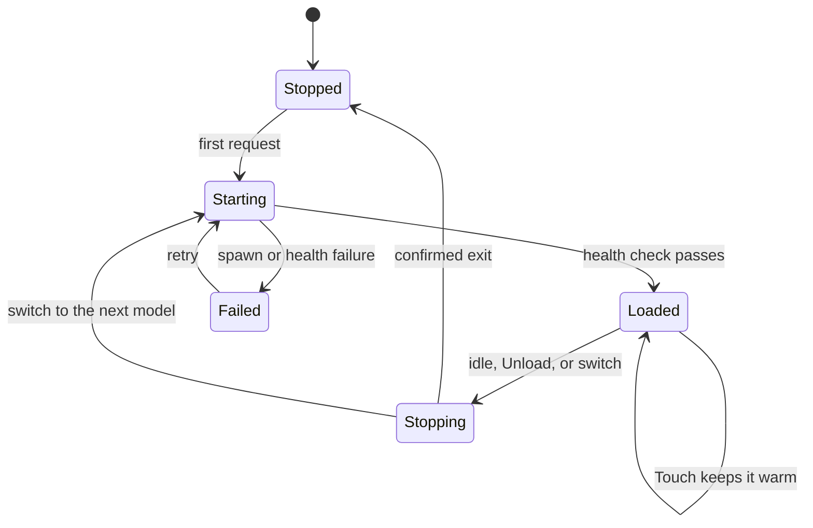
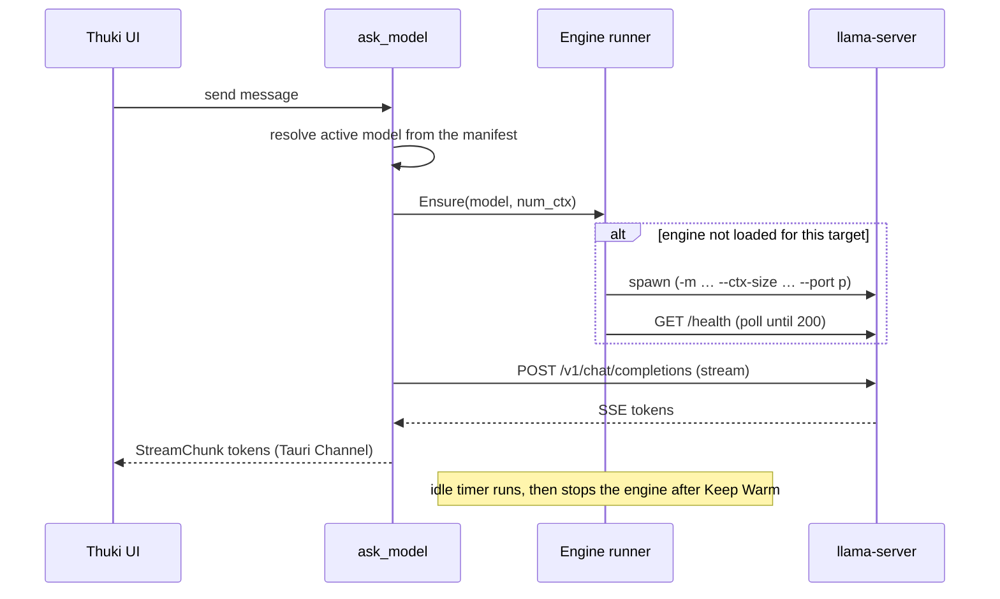

# Models and Providers

A deep dive into how Thuki runs AI on your Mac: the built-in engine, what powers it, what a model actually is, where models live, and exactly how the inference server starts, runs, and stops. If you just want to download a model and chat, the short version is "open Settings, pick a model in Discover, done." Everything below is for when you want to understand what is happening under the hood.

> macOS only, Apple Silicon (M1/M2/M3/M4/M5). See [thuki.app](https://www.thuki.app/) for downloads.

## Contents

- [The big picture](#the-big-picture)
- [The built-in engine](#the-built-in-engine)
- [What a model is (and the words around it)](#what-a-model-is-and-the-words-around-it)
- [Getting a model: download, verify, install](#getting-a-model-download-verify-install)
- [Where models live on disk](#where-models-live-on-disk)
- [Running inference: the sidecar](#running-inference-the-sidecar)
- [A chat request, end to end](#a-chat-request-end-to-end)
- [How the engine binary is packaged](#how-the-engine-binary-is-packaged)
- [Settings → Models](#settings--models)
- [Providers: built-in vs Ollama](#providers-built-in-vs-ollama)

## The big picture

Thuki ships its own inference engine and runs it entirely on your machine. Nothing about a chat leaves your Mac. The app you interact with (the overlay and the Settings window) talks to a small local server that loads a model and generates text. That local server is the **built-in engine**.


Thuki supports two **providers** (the thing that runs the model): the **built-in** engine (the default, fully managed by Thuki) and **Ollama** (your own install, optional). Both run llama.cpp under the hood; the difference is who manages it. The rest of this guide is mostly about the built-in engine.

## The built-in engine

The built-in engine is a bundled copy of **llama.cpp's `llama-server`**.

- **llama.cpp** is the widely used open-source C/C++ engine for running LLMs efficiently on consumer hardware, including Apple Silicon (it uses Metal for GPU acceleration). It is the same engine that powers Ollama, LM Studio, and most local-AI apps.
- **`llama-server`** is the HTTP server binary that ships with llama.cpp. You give it a model file, and it exposes an **OpenAI-compatible `/v1` API** over a local port. Thuki sends it standard `/v1/chat/completions` requests and streams the response back token by token.

Thuki bundles this binary so there is nothing for you to install: the engine is already inside the app. (Ollama is the same idea, just managed by Ollama instead of Thuki.)

## What a model is (and the words around it)

A few terms show up constantly. Here is what each one means.

### Weights

A model is a large pile of numbers called **weights**, the trained "knowledge" learned during training. Running the model ("inference") means feeding your text through those weights to predict the next token. Bigger models have more weights, are smarter, and need more memory.

### GGUF

**GGUF** is the single-file format llama.cpp uses to store a model. One `.gguf` file bundles everything the engine needs:

- the quantized **weights**,
- the **tokenizer** (how text is split into tokens),
- **metadata**: the model architecture, its trained context length, its **chat template**, and capability hints.

Thuki reads that metadata directly from the file (with a bounded, panic-safe parser) to classify each model's capabilities, for example whether it reasons, before you ever run it.

### Hugging Face

**Hugging Face** is the public hub where the community publishes models. A model lives in a **repo** (for example `bartowski/Qwen3.5-9B-GGUF`), and a repo can hold several GGUF files (different quantizations of the same model). Thuki's curated picks each pin a repo at an **exact git revision**, so "the same model" always means the same bytes, not whatever the repo happens to contain today.

### Quantization

Full-precision weights are big. **Quantization** compresses them to fewer bits per number, which shrinks the file and the memory it needs, at a small cost to quality. This is why one model has many GGUF files: each is a different size/quality trade-off.

You will see names like `Q4_K_M`:

| Name     | Roughly means | Trade-off                                      |
| -------- | ------------- | ---------------------------------------------- |
| `Q8_0`   | 8-bit         | Largest, closest to full quality               |
| `Q6_K`   | 6-bit         | Large, very high quality                       |
| `Q5_K_M` | 5-bit, medium | Balanced, high quality                         |
| `Q4_K_M` | 4-bit, medium | The common sweet spot: small, fast, still good |
| `Q3_K_*` | 3-bit         | Smaller and faster, noticeably lower quality   |

For most Macs, a `Q4_K_M` build of a model that fits in memory is the right starting point. Discover's **Staff picks** are already chosen with this in mind.

### mmproj (vision)

A vision model needs a second file, the **multimodal projector** (`mmproj`), that turns an image into something the model can read. Thuki downloads it alongside the main model and passes it to the engine with `--mmproj`. Models with this companion show a **Vision** badge.

### Capabilities

Each model advertises passive badges, derived from its GGUF metadata:

- **Vision**: accepts images (has an `mmproj` companion).
- **Reasoning**: thinks before answering. Triggered per message with `/think`; some models always reason ("Always reasons").

Each model also reports its trained **context window** (how many tokens it can see at once).

## Getting a model: download, verify, install

You add models in **Settings → Models → Discover**, which has two sub-tabs:

- **Staff picks**: a small, vetted catalog grouped by use case (everyday chat, compact and fast, deep reasoning). Each is pinned and size-checked.
- **Browse all**: a live search of GGUF models on the Hugging Face Hub. Anything you find downloads straight in.

When you start a download, Thuki streams the file from Hugging Face and verifies it before it ever counts as installed:


Key properties:

- **Resumable.** Bytes land in a `tmp/<sha256>.partial` file. If the download is interrupted, it resumes with an HTTP `Range` request instead of starting over.
- **Verified.** On completion, the file is streamed through SHA-256 and checked against the hash Thuki expects. A mismatch deletes the partial; you can re-download cleanly. This hash is an **integrity** check (it catches truncation, bit rot, a corrupt resume), not a provenance control. Trust in _what_ the file is comes from the **pinned repo revision**, not the hash.
- **Atomic install.** Only after verification does the partial get atomically renamed into the blob store, so a half-downloaded file can never be mistaken for an installed model.
- **One at a time** for the built-in engine's own slot, so downloads do not contend for bandwidth or disk in surprising ways.

## Where models live on disk

Thuki stores models in a **content-addressed blob store** under its application-support directory (alongside `config.toml`, at `~/Library/Application Support/com.quietnode.thuki/`). "Content-addressed" means a file's name _is_ its SHA-256 hash:

```
<app support>/…/
├── blobs/
│   ├── <sha256-of-model-A>        ← a verified GGUF, named by its hash
│   ├── <sha256-of-mmproj>         ← a vision projector
│   └── <sha256-of-model-B>
└── tmp/
    └── <sha256>.partial           ← only while a download is in flight
```

A separate SQLite table, `installed_models`, is the index that maps a human model id (`"<repo>:<file_name>"`) to the blob(s) it uses. Because blobs are addressed by content, two models that reference the **same** file (for example two vision models sharing one `mmproj`) point at one blob on disk instead of duplicating it.

To open this folder yourself, use **Reveal** from a model's row in the Library.

## Running inference: the sidecar

### What "sidecar" means

The engine is a **separate process**, not code running inside the Thuki app. Thuki spawns `llama-server` as a child process and supervises it directly with `tokio::process` (it does not go through Tauri's shell plugin), so Thuki owns the process's start, stop, and kill.

### Is the server always running? No, Thuki turns it on and off

Thuki manages the engine's lifecycle so it only uses memory when it needs to:

- It starts the engine **on demand** (when you send a message and no engine is loaded for that model).
- It keeps the model **warm** between messages according to **Keep Warm**, so follow-ups are instant.
- After your chosen idle window it **stops** the engine to free RAM.
- On app quit it **kills** the engine and waits for a confirmed exit, so no orphan `llama-server` is left running.

Two invariants hold at all times: **at most one engine process exists**, and **never are two models resident at once**. A model switch (or a context-size change) always kills the old process and waits for it to exit before spawning the new one.

The engine moves through a small state machine:



A "target" is the tuple `{model_path, mmproj_path, num_ctx}`. The running engine is reused only when **every** field matches. That is why changing the context window restarts the engine: the context size is fixed at `llama-server` startup, so a different `num_ctx` is a different target.

### How Thuki controls it (the runner)

A single async actor, the **runner**, owns the live child process. The rest of the app sends it commands over a bounded queue:

- **Ensure** (model X is needed: start it if necessary, or no-op if already loaded),
- **Touch** (mark activity, resetting the idle timer to keep it warm),
- **SetIdleMinutes** (apply a new Keep Warm value),
- **Unload** (stop now and free memory),
- **Shutdown** (on quit).

Every state transition is published on a watch channel, which is how the Settings panel shows "Loading…", "warming…", or "<model> in memory" live. Startup readiness is a `/health` poll loop: Thuki spawns the process, then repeatedly GETs `http://127.0.0.1:<port>/health` until it returns `200` (a `503` means the model is still loading) or a deadline is hit.

### The spawn line

When Thuki starts the engine, the command line is:

```
llama-server -m <model.gguf> [--mmproj <proj.gguf>] --ctx-size <n> \
             --host 127.0.0.1 --port <p> --no-webui --parallel 1
```

- `-m <model.gguf>`: the blob path of the active model.
- `--mmproj <proj.gguf>`: the vision projector, only for vision models.
- `--ctx-size <n>`: the context window (`num_ctx`), fixed for the life of the process.
- `--host 127.0.0.1`: **loopback only**. The server is bound to `127.0.0.1:0`, so the OS hands out a free port that only your machine can reach. Nothing on your network can connect.
- `--no-webui`: llama-server's built-in web UI is disabled. The only thing talking to the engine is Thuki.
- `--parallel 1`: a single inference slot, so a model loads once and your chat always hits the same warm slot.

## A chat request, end to end

Putting it together, here is what happens when you send a message on the built-in provider:



The frontend never talks to the engine directly. It calls the `ask_model` Tauri command, which resolves the model, ensures the engine is up, opens the streaming `/v1` request, and relays each token to the UI as a typed `StreamChunk` over a Tauri Channel.

## How the engine binary is packaged

The `llama-server` binary and its dynamic libraries are bundled into the app:

- It ships as a Tauri `externalBin` (`binaries/llama-server`), and its dylib closure is bundled in the macOS `frameworks` list, resolved at runtime through a `@loader_path/../Frameworks` rpath.
- A build script (`scripts/ensure-llama-server.ts`) fetches a **pinned** llama.cpp release, verifies the download's SHA-256, prunes the dylib closure to what is actually needed, and ad-hoc re-signs everything. It runs automatically before `dev` and the production build.
- The pin is two constants (a release tag and the asset's SHA-256). llama.cpp moving forward does not change a pinned build; the pin is bumped deliberately only after manual checks on real hardware (see [release-process.md](./release-process.md)).

Security posture: the engine binds loopback only, the web UI is off, there is no `0.0.0.0` bind, and downloaded GGUF metadata is parsed with bounded, panic-safe code. See [SECURITY.md](../SECURITY.md).

## Settings → Models

Day to day, you manage all of this from **Settings → Models** (open Settings from the Thuki menu-bar icon: right-click it and choose **Settings…**). Three tabs:

- **Library**: your installed models, with capability badges and a `size · context · maker · quant` line. Per row: set active, reveal the file on disk, or delete it.
- **Discover**: **Staff picks** (the curated catalog) and **Browse all** (raw Hugging Face search).
- **Providers**: the active provider as a hero card, the other as a compact row, and a shared **Generation** section: the context window, **Keep Warm**, and the system prompt. See [Tuning the Context Window](./tuning-context-window.md).

## Providers: built-in vs Ollama

|                   | **Built-in** (default)                | **Ollama** (optional)                 |
| ----------------- | ------------------------------------- | ------------------------------------- |
| Who runs it       | Thuki                                 | You (install Ollama yourself)         |
| Setup             | None, it is bundled                   | Install Ollama, `ollama pull <model>` |
| Engine underneath | llama.cpp `llama-server`              | llama.cpp (Ollama's own build)        |
| Models            | GGUF files Thuki downloads and stores | Whatever you pull in Ollama           |
| Lifecycle         | Thuki starts/stops/kills the sidecar  | Ollama manages its own server         |

Both are local and private; both are llama.cpp underneath. The built-in engine exists so Thuki works the moment you install it, with nothing to set up. If you already run Ollama and prefer it, switch to it in **Settings → Models → Providers**; switching frees the model the other provider was holding, so only one is resident at a time.
