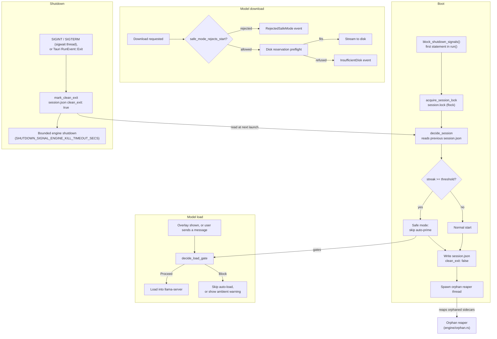
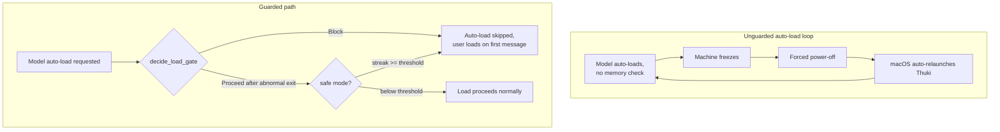
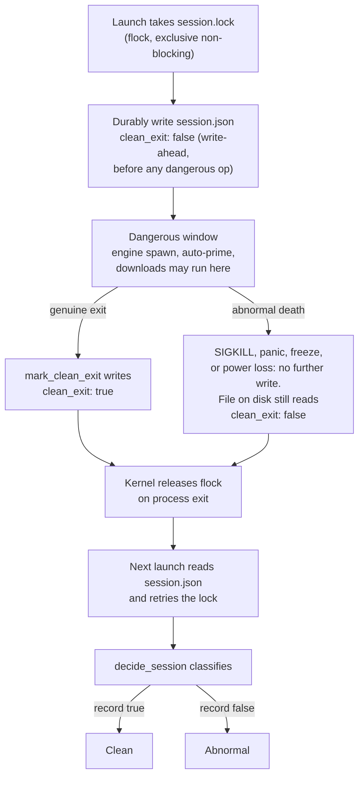
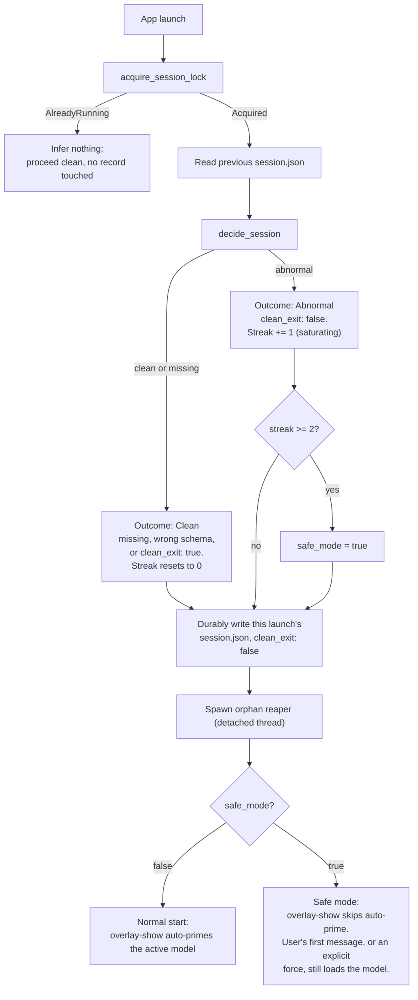
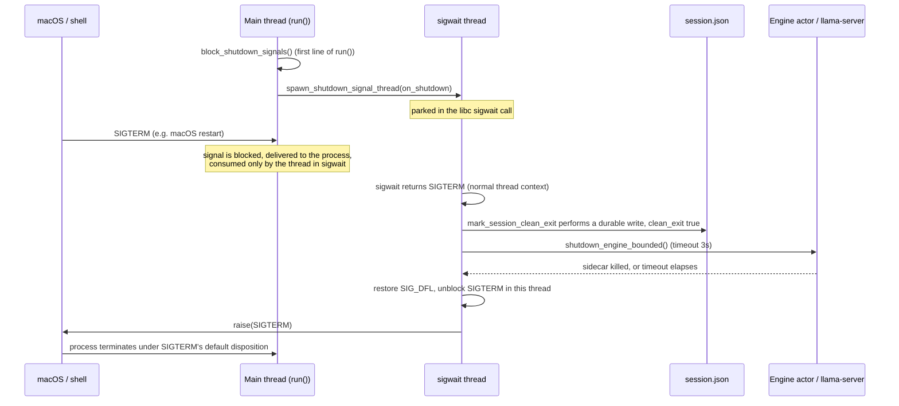
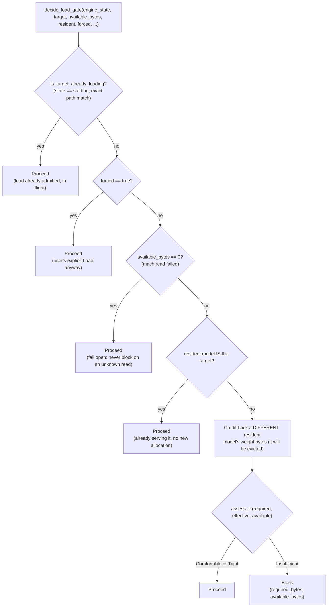
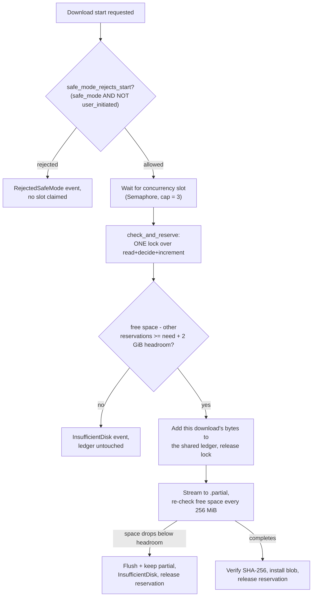
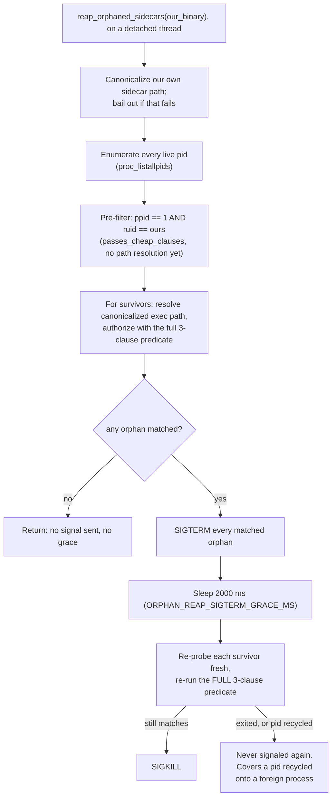

# Memory Guardrails and Crash Safety

## 1. Overview

Local model inference is memory-hungry. Loading a model whose footprint exceeds available memory can starve macOS itself of the memory it needs to keep running, freezing the whole machine, not just the app, and forcing a hard power-off to recover. The sharper problem shows up on the next launch: because macOS reopens apps that were running when the machine went down, an auto-load with no memory check that freezes the machine once will run again unconditionally on relaunch, freezing the machine again before the user can intervene. That deadloop, one that only a "don't let the app start" workaround could break, is worse than the single freeze: an oversized load is a single bad decision, but a deadloop repeats it forever with no window for the user to act.

The fix is a set of independent layers, each closing one way the app could keep spending a scarce resource (memory or disk) without checking first, or keep repeating a decision that already went badly:

- **Boot**: a crash detector proves whether the previous run exited cleanly, and a circuit breaker (safe mode) stops the no-user-action auto-load after repeated abnormal exits, so the deadloop cannot repeat past the threshold.
- **Model load**: a memory admission gate estimates a model's footprint against live available memory before any load, real or auto-primed, is allowed to proceed.
- **Download**: a disk-space preflight and a reservation ledger stop a model download from filling the volume, and safe mode blocks automatic download retries the same way it blocks automatic model loads.
- **Shutdown**: a polite stop (Ctrl+C, or the `SIGTERM` macOS sends on restart) is durably recorded as a clean exit and the built-in engine sidecar is killed under a bounded timeout, so an ordinary restart is never mistaken for a crash and the sidecar does not outlive the app.
- **Startup cleanup**: an orphan reaper kills `llama-server` sidecars left behind by a previous Thuki that died in a way nothing could catch (`SIGKILL`, a kernel panic, a machine freeze), reclaiming the memory they hold.

Each layer is independently useful and degrades safely on its own: a bad memory read never blocks a load, a bad disk read never blocks a download, and a failure to acquire the crash-detection lock never blocks startup. The next sections cover each layer in the order the code runs them, then the failure modes it addresses, then a tight list of the invariants that must hold for the whole thing to work, then the prior art it borrows from.

## 2. Motivation

Local model inference is memory-hungry. These are the failure modes the guardrails in this document exist to close:

- **Memory exhaustion freezes the machine, not just the app.** Loading a model whose footprint exceeds available memory can starve macOS itself of memory it needs to keep running, freezing the whole machine rather than just crashing Thuki.
- **An unchecked auto-load turns one freeze into a deadloop.** If a model auto-loads on launch with no memory check, the exact same no-user-action work reruns on every relaunch, because macOS reopens apps that were running when the machine went down. A single freeze is a bug; a freeze that reliably reproduces itself on every subsequent launch, with no window for the user to intervene, is a deadloop. This is the sharpest failure mode of the set, and the one the circuit breaker (Section 4) is built to break.
- **Downloads can exhaust disk space the same way loads exhaust memory.** A model download with no disk-space check can fill the volume, the storage-side mirror of the memory problem above.
- **An uncatchable death leaves the engine sidecar orphaned.** A freeze, a `SIGKILL`, or a kernel panic runs no shutdown code at all, so the `llama-server` sidecar the dead process was holding lingers, still resident, across the crash.
- **A normal restart must not look like a crash.** macOS delivers `SIGTERM` to every running app during an ordinary system restart. Left unhandled, that signal would be indistinguishable from an abnormal death and would erode the crash-loop counter toward a false safe mode, punishing a user who never actually crashed.

Three systemic gaps let these failure modes happen: no admission check before a model load, so a model could be primed into memory with no regard for what the machine actually had free; no disk preflight before a download claimed space it might not have; and no crash-loop breaker, so an auto-load that had just frozen the machine would run again, unconditionally, on the very next launch.

**What catches each failure mode now:**

| Failure mode                                                                  | Guardrail that catches it now                                                                                                                                |
| ----------------------------------------------------------------------------- | ------------------------------------------------------------------------------------------------------------------------------------------------------------ |
| A model load proceeds with no check against available memory                  | The memory admission gate (`decide_load_gate`, Section 6) blocks an auto-prime whose estimate does not fit available memory                                  |
| A download can exhaust disk space the same way a load exhausts memory         | The disk reservation preflight (Section 7) refuses a download that could not fit, and safe mode blocks an automatic retry after a crash-loop                 |
| An uncatchable death leaves no clean-exit record                              | The crash detector (Section 3) durably records `clean_exit: false` before the dangerous work runs, so the next launch can see it                             |
| An unchecked auto-load repeats on every relaunch after a crash                | The circuit breaker (Section 4) reads the abnormal record and, once the streak reaches the threshold, skips the no-user-action auto-load entirely: safe mode |
| An uncatchable death leaves the engine sidecar orphaned, still holding memory | The orphan reaper (Section 8) kills any `llama-server` left parented to `launchd` at the next successful launch                                              |

## 3. Crash detection: how Thuki knows the last run died badly

Thuki hides on window close and only quits from the tray, so a clean, cooperative exit almost never happens during a normal session; the app just sits hidden, ready to reappear on the next hotkey press. That means crash detection cannot lean on "did the app tell us it was shutting down": it has to work even when nothing runs at the moment of death, because for most abnormal deaths (a freeze, `SIGKILL`, an OS out-of-memory kill, a power loss) nothing does. `src-tauri/src/startup_guard.rs` solves this with two independent proofs of liveness that both survive process death by any cause, and neither depends on the dead process having cooperated.

**The write-ahead record.** Every launch writes a small JSON file, `session.json` (`DEFAULT_SESSION_RECORD_FILENAME`, `src-tauri/src/config/defaults.rs:659`), next to `config.toml`. The record (`SessionRecord`, `startup_guard.rs:335-351`) carries a schema version, the boot time, the launch time, a `state` (`Ok` or `Crashed`), the activity in flight, a consecutive-abnormal counter, and the field that matters most: `clean_exit`. At the start of every launch, before any dangerous auto-op (spawning the engine, auto-priming a model, starting a download) can run, Thuki durably writes this record with `clean_exit: false` (`run_startup_guard`, `startup_guard.rs:193-253`, the write at `startup_guard.rs:226-231`). Only one code path ever flips it to `true`: `SessionWriter::mark_clean_exit` (`startup_guard.rs:773-778`), called from `lib.rs` on a genuine exit (Section 5 covers exactly when).

This is a **write-ahead** design, not just an ordinary status flag, and the distinction matters: the record is written to say "false" _before_ the risky work starts, not after it finishes. If the app freezes or gets killed anywhere in that dangerous window, whatever is on disk at that moment is what the next launch reads, and because the write already landed, that value is `false`. A record written only after the dangerous work completed would leave nothing behind for a freeze that happens mid-work; write-ahead is what makes the record trustworthy specifically during the window where a crash actually happens.

**Why durability needs three things, not one.** A crash detector is worthless if the very write meant to catch a crash can itself be lost to one. On APFS (the filesystem under `~/Library/Application Support/...`), a plain `rename()` is atomic (the file either fully appears at the new name or doesn't; no reader ever sees a half-written file), but atomicity says nothing about surviving a power cut: the drive's own write cache can still be holding the data in volatile RAM when the power drops, atomic rename or not. And a plain `fsync`/`sync_all` on macOS flushes the OS's page cache to the drive, but does _not_ force the drive to flush its own onboard write cache; only `fcntl(fd, F_FULLFSYNC)` does that. `durable_write_bytes` (`startup_guard.rs:609-640`) therefore does all three in order: write the new content to a temp file and call `F_FULLFSYNC` on it (`full_fsync`, `startup_guard.rs:583-591`) so the drive itself confirms the bytes are down, then `rename()` the temp file over the target so a reader never sees a partial write, then `fsync` the containing directory (`fsync_dir`, `startup_guard.rs:596-599`) so the rename itself (a directory-entry change) is durable too. Drop any one of the three and there is a window where a power loss can erase or corrupt the very evidence the guard exists to leave behind.

**The advisory lock and the kernel's guarantee.** The second proof of liveness is `session.lock` (`DEFAULT_SESSION_LOCK_FILENAME`, `defaults.rs:665`), an otherwise-empty file that the launch takes an exclusive, non-blocking `flock` on (`acquire_session_lock`, `startup_guard.rs:544-558`, using `libc::flock(fd, LOCK_EX | LOCK_NB)`) and holds open for the entire process lifetime by keeping the `File` handle alive inside the managed `SessionGuard` (`startup_guard.rs:147-163`). `flock` is an advisory lock: the kernel does not stop other processes from touching the file, but it tracks which process holds the lock, and per `man 2 fcntl`, every lock a process holds on a file is released the instant that process closes its last descriptor to it, which happens automatically and unconditionally when the process dies, for _any_ reason: a clean exit, a panic, `SIGKILL`, an OS OOM-kill, or a power loss. There is no cooperation required from the dying process; the kernel does this as a side effect of tearing down its file table. That is exactly the proof this needs: if a second launch can take the lock, the previous holder is provably dead, full stop, with zero trust placed in whatever that previous process did or didn't manage to write before it died.

The lock has one more job: distinguishing "the previous instance is dead" from "the previous instance is still running as a second window." If `acquire_session_lock` fails with `EWOULDBLOCK`, that means another live Thuki currently holds the lock (`SessionLock::AlreadyRunning`, `startup_guard.rs:242-247`), which is a completely legitimate state, not a crash. In that case the new launch does not touch the record, does not install the panic hook, and does not enter safe mode: it infers nothing and proceeds as an ordinary second instance, leaving the live instance's own record alone. One more detail matters for correctness here: the lock file descriptor is opened with `O_CLOEXEC` (Rust sets this on every fd it opens by default; see `startup_guard.rs:518-522`), so it does not leak across the `fork`/`exec` that spawns the `llama-server` sidecar. If it did leak, the sidecar would keep the lock held even after Thuki itself died, and the next Thuki launch would see the lock as still taken and wrongly conclude a live instance was still running, silently defeating crash detection in the unsafe direction.

**Classifying what happened: `decide_session`.** With the write-ahead record and the lock in place, the actual verdict is pure logic with no I/O, in `decide_session` (`startup_guard.rs:427-466`). It reads the _previous_ launch's record: if there is none (fresh install), or it's the wrong schema, or `clean_exit` is `true`, the outcome is `Clean`, the streak resets to 0, and safe mode is off; this is a deliberate fail-open contract, so a missing or corrupted file can never itself trigger safe mode. If the previous record exists, matches the current schema, and has `clean_exit: false`, the outcome is `Abnormal`: the consecutive-abnormal streak increments (saturating, so it can never overflow into wraparound), and the classified _cause_ (used purely for the recovery message, see below) is `Crashed` if the panic hook had marked the record, else `MachineRestart` if `kern.boottime` changed since the previous launch, else `ProcessDied` (same boot, no panic recorded: a freeze, `SIGKILL`, or an OS OOM-kill).

**The panic hook records a cause, never a gate.** `install_panic_hook` (`startup_guard.rs:717-723`) is installed once the session lock is taken, and it durably rewrites the record's `state` to `Crashed` (`mark_crashed`, `startup_guard.rs:692-704`) before chaining to whatever hook ran previously. This only refines _why_ an abnormal exit happened, for the recovery message the frontend can show; it cannot catch a `SIGKILL`, a kernel panic, or a power loss, because none of those run any Rust code at all, by construction. Those cases are still caught correctly as `Abnormal`: the write-ahead record and the kernel-released lock together are sufficient, and the panic hook is a nice-to-have refinement on top, never a requirement. And to say the load-bearing point in Section 3 as plainly as possible so it is unambiguous heading into Section 4: `boot_time_secs` and `activity` are read into the decision only to build the human-readable cause and the recovery-UI context; the actual `safe_mode` boolean is computed from `clean_exit` and the streak alone (`startup_guard.rs:432-437` states this explicitly as a `why` comment), a point the invariants section revisits because getting it backwards would silently defeat the guard against exactly the failure class it exists for.

## 4. The crash-loop circuit breaker (safe mode)

Section 3 covers how a single launch classifies whether the _previous_ run ended cleanly. This section covers what happens once a pattern of abnormal exits has been seen: how that classification turns into an actual action that stops the deadloop from repeating.

Safe mode engages when two conditions both hold: the previous session's `clean_exit` was `false`, and the consecutive-abnormal streak has reached `DEFAULT_STARTUP_SAFE_MODE_THRESHOLD`, which is `2` (`config/defaults.rs:676`). The streak is carried in the record itself (`consecutive_abnormal`, `startup_guard.rs:350`) and incremented by `decide_session` on every abnormal launch, so it survives across restarts; a clean exit resets it to 0.

The threshold is 2, not 1, on purpose: a single hard reboot or a single `kill -9` should not immediately nag the user with a safe-mode screen, since either can happen for reasons that have nothing to do with Thuki (the user force-quit something else, a routine OS update rebooted the Mac). Only a _second consecutive_ abnormal exit, on top of the first, is treated as a real pattern worth interrupting the user's normal flow for. This directly mirrors Firefox's `toolkit.startup.max_resumed_crashes` design (Section 10 covers the prior art in more depth): tolerate one, act on two.

**What safe mode actually changes.** The only thing safe mode disables is the no-user-action auto-prime: the model load that normally fires every time the overlay is shown (double-tap, tray click, or first-launch auto-show), whether the active provider is the built-in engine or Ollama (`lib.rs:613-643`). When `StartupSafety::safe_mode()` reads `true`, the overlay-show handler resolves an empty provider-kind string, which falls through the `match` to its no-op arm (`lib.rs:631-643`), skipping both the built-in and the Ollama auto-prime paths entirely; when it reads `false`, behavior is unchanged from before this feature existed.

Crucially, safe mode does not disable inference, and it is not a lockout: it only _defers_ the load from "automatic, no user action" to "the user's own first message." Sending a message still works exactly as before, because `ask_model` ensures the sidecar (or the Ollama connection) on demand regardless of `StartupSafety`; the memory admission gate from Section 6 is the thing that actually judges whether that on-demand load is safe, independently of safe mode. A user can also explicitly force a load past the memory gate (the "Load anyway" affordance forwards `force: true` into `preflight_memory_gate`, see Section 6); safe mode has no opinion on that either. In short: safe mode's whole job is removing the _automatic_ trigger that causes the deadloop, while leaving every _deliberate_ user action untouched. Downloads get a parallel treatment (Section 7): safe mode blocks a non-user-initiated download start, but a user's own click through the download UI still goes through.

## 5. Signals and clean exit

Section 3 established that exactly one code path is allowed to write `clean_exit: true`, and that a genuine exit is what triggers it. This section covers what counts as "genuine" and how the write happens safely.

Thuki normally quits only from the tray, and Tauri's own `RunEvent::Exit`/`RunEvent::ExitRequested` handlers already call `mark_session_clean_exit` on that path (`lib.rs:3178-3218`; see the `RejectedSafeMode`-adjacent code in Section 7 for the sibling case in downloads). But two other stops never run those handlers at all: `SIGINT` (Ctrl+C in a dev terminal) and `SIGTERM`, which is what macOS sends to every running app during a system shutdown or restart. Without handling them, either would leave `clean_exit: false` on disk and get miscounted as abnormal, and because macOS sends `SIGTERM` on every single restart, that would mean _every ordinary Mac restart_ nudges the abnormal streak upward, eventually tripping safe mode for a user who never actually crashed. A polite, controlling-process-requested stop has to be treated as a clean exit.

**Blocking the signal, and why the very first line of `run()` matters.** `startup_guard::block_shutdown_signals()` is the first statement executed in `run()` (`lib.rs:2441-2450`), before Tauri's builder, before any plugin, before any thread is spawned. It calls `pthread_sigmask(SIG_BLOCK, ...)` on the calling (main) thread for exactly `SHUTDOWN_SIGNALS = [SIGINT, SIGTERM]` (`startup_guard.rs:852, 892-900`). The ordering is load-bearing: POSIX specifies that a newly spawned thread inherits the signal mask of the thread that spawned it. By blocking on the main thread before anything else runs, _every_ thread Tauri and Thuki subsequently spawn inherits the same block. That guarantees the signal is not delivered to some arbitrary thread running its own default (terminate-immediately) disposition; it can only be delivered to whichever thread explicitly asks for it.

**The dedicated `sigwait` thread.** That thread is spawned later, once the session record actually exists (`spawn_shutdown_signal_thread`, called at `lib.rs:2674-2678`, defined at `startup_guard.rs:928-962`). It calls `libc::sigwait`, which parks the thread until one of the blocked signals arrives, then returns the signal number in _normal_ execution context, not inside a signal handler. That distinction is the whole reason this pattern exists: `durable_write_bytes` (the clean-exit write) calls `F_FULLFSYNC`, does a filesystem rename, and fsyncs a directory, none of which are async-signal-safe, meaning none of them are safe to call from inside an actual signal handler (a handler can interrupt arbitrary code mid-allocation or mid-lock, and calling non-reentrant functions there can deadlock or corrupt state). `sigwait` sidesteps that entirely: the signal is _blocked_, so it never invokes a handler at all; it simply sits pending until the dedicated thread asks for it via `sigwait`, at which point ordinary blocking syscalls are completely legal.

**What runs on that thread, and in what order.** The closure passed to `spawn_shutdown_signal_thread` does two things in sequence (`lib.rs:2675-2678`): first `mark_session_clean_exit`, then `shutdown_engine_bounded`. The order is deliberate, not incidental. The clean-exit write is the sole input to the safe-mode decision and has no backstop of its own: if it never lands, the next launch has no way to know this exit was actually polite, so it must run first and unconditionally. The engine shutdown that follows can hang (a wedged `llama-server` is exactly the kind of thing this whole feature exists to guard against), so it is bounded by `SHUTDOWN_SIGNAL_ENGINE_KILL_TIMEOUT_SECS = 3` seconds (`defaults.rs:134`, applied in `shutdown_engine_bounded`, `lib.rs:448-462`, via `tokio::time::timeout` around the engine actor's `shutdown()`). If the sidecar does not die within that window, the shutdown thread simply moves on: any sidecar that outlives the bound becomes the orphan reaper's problem at the next launch (Section 8), not this thread's. Running the clean-exit write first, unconditionally, and only then attempting a bounded best-effort kill, means a wedged engine can never prevent the app itself from terminating on schedule.

**Re-raising to die correctly.** After `on_shutdown` returns, the thread restores the signal's default disposition (`libc::signal(signum, SIG_DFL)`), unblocks it in this thread specifically (`SIG_UNBLOCK`, since it is still blocked here and an unblocked-but-still-blocked re-raise would just sit pending forever), and calls `libc::raise(signum)` (`startup_guard.rs:953-960`). The process then actually terminates under the signal's own default disposition, exactly as if Thuki had never intercepted it, so its wait-status (`WIFSIGNALED`) and whatever a parent process (like a shell, or macOS's own shutdown coordinator) expects both stay correct. `on_shutdown` runs at most once per process, by construction: once the re-raise lands, the process is gone.

**Why `SIGKILL` is deliberately excluded.** `SHUTDOWN_SIGNALS` contains only `SIGINT` and `SIGTERM`, never `SIGKILL` (`startup_guard.rs:852`); this is not an oversight, it is not even possible to change by accident, because `sigaddset` cannot add `SIGKILL` to a mask in the first place; the kernel refuses. `SIGKILL`, a kernel panic, a power cut, and a machine freeze all terminate the process without running any user code whatsoever, by construction: there is no handler, no thread, no cleanup path they run through. Those deaths must continue to be classified as abnormal (that is precisely the memory-pressure class of failure this whole feature exists to catch), so nothing here ever tries to catch them; they simply leave `clean_exit: false` on disk for the next launch to find, exactly as described in Section 3.

**The sidecar must not inherit the block.** One more piece closes the loop with Section 8. The parent blocking `SIGINT`/`SIGTERM` on itself would, by default, also be inherited by the spawned `llama-server` child across `fork`+`exec` (POSIX preserves the signal mask across both). If it were inherited, an orphaned sidecar left behind by an uncatchable death would ignore `SIGTERM` forever, and only `SIGKILL` could ever reap it. `engine/process.rs` registers a `pre_exec` hook, `reset_child_signal_mask` (`engine/process.rs:262-291`), that runs in the forked child between `fork` and `exec` and clears its signal mask back to empty via `pthread_sigmask(SIG_SETMASK, &empty, ...)`, using only async-signal-safe calls as `pre_exec`'s contract requires. This is what makes the orphan reaper's polite `SIGTERM`-then-`SIGKILL` escalation (Section 8) actually work as a two-step process instead of degrading to `SIGKILL`-only.

## 6. The memory admission gate

This is the guardrail that stops the sharpest failure mode from Section 2: a model load that goes ahead with no regard for whether the machine actually has room for it. It lives in `src-tauri/src/models/memory.rs`.

**One decision, shared by every caller.** `decide_load_gate` (`memory.rs:285-310`) is documented in the code as "the single authoritative would-loading-this-target-be-blocked decision", and that framing is the point: both the real admission path, `preflight_memory_gate` in `commands.rs:301-343` (called from the built-in load path and from `spawn_gated_builtin_warmup` in `warmup.rs:530-537`), and the frontend's fit-estimate command, `build_model_fit_estimate` (`memory.rs:419-460`, behind `estimate_model_fit`), route through this exact function. The module doc is explicit about why: a duplicated gate that silently drifted out of sync between the real load path and a display-only estimate is precisely the shape of bug that lets a memory-exhaustion freeze slip through, since two copies of "does this fit" logic can each individually look correct while disagreeing with each other.

**What it reads.** Available memory comes from `available_memory_bytes` (`memory.rs:326-383`), a direct mach `host_statistics64(HOST_VM_INFO64)` syscall. It reads four page classes the kernel can hand out without swapping: free, inactive, speculative, and purgeable pages, and multiplies their sum by the page size (`available_from_vm_stats`, `memory.rs:84-96`, the pure arithmetic core, saturating throughout so a pathological kernel snapshot can never wrap into a falsely small number). This deliberately reads _available_ memory, not `hw.memsize` (total physical RAM, which `system_ram_bytes` reads elsewhere): total RAM says nothing about whether a load will fit _right now_, given everything already resident (the OS, other apps, a model already loaded). One FFI detail worth calling out for correctness: `mach_host_self` hands back a Mach send right the caller owns, and the function releases it via `mach_port_deallocate` on every exit path, success or failure (`memory.rs:364-371`), so the read cannot leak a kernel port on repeated calls.

The model's estimated footprint is `estimate_required_bytes` (`memory.rs:104-109`): the weights' on-disk size plus a fixed `RUNTIME_OVERHEAD_GB` of 2.0 GiB (`defaults.rs:504`), covering the KV cache at the default context plus runtime buffers. And when a _different_ model is already resident, its weight bytes get credited back into the available figure via `effective_available_bytes` (`memory.rs:180-194`), because the engine frees the currently-loaded model before loading the next one, so judging the new load against memory that will be freed first (rather than memory as it stands with both models counted) is the economically correct comparison.

**The two short-circuits that must stay Proceed.** `decide_load_gate` checks, in order: first, whether the engine is already mid-load for this _exact_ target (`is_target_already_loading`, `memory.rs:207-211`, state `"starting"` with a matching model path). Such a load was already admitted by an earlier, separate gate check (for instance, an overlay-show auto-prime when more memory happened to be free); re-judging it here against memory that same load has already started spending would spuriously block a load that is already underway and on track to finish. Second, inside `evaluate_load_gate` (`memory.rs:228-268`), whether the resident model _is_ the target itself: reusing an already-loaded model is a no-op with no new allocation, so it must never be blocked, even if the model happens to occupy memory that would otherwise read as insufficient for a _fresh_ load of the same size.

**Why the UI must branch on `would_block`, never on the display verdict.** `ModelFitEstimate` (`memory.rs:388-402`) carries both a `verdict` (`Comfortable` / `Tight` / `Insufficient`, for display) and a separate `would_block: bool`. These can legitimately disagree: the two short-circuits above mean a target can display as `Insufficient` (its raw footprint genuinely exceeds the ceiling fraction of available memory) while the _gate_ would still admit it, because it's already resident or already mid-load. If the frontend branched control flow on the display verdict instead, a resident model reading "Insufficient" could get spuriously blocked from continuing to serve, which is the opposite of what the estimate is supposed to convey. `would_block` is computed by calling `decide_load_gate` directly (`memory.rs:441-453`) so it is always the real gate decision, never a re-derivation of it from the cosmetic verdict.

**Force and fail-open.** A user's explicit "Load anyway" sets `forced: true`, which short-circuits straight to `Proceed` before any arithmetic (`memory.rs:236-238`); this is the sole bypass, reused identically by both the real gate and the estimate path, never a second parallel escape hatch. Separately, if `available_bytes` reads as `0` (the mach syscall itself failed), the gate fails open to `Proceed` (`memory.rs:247-249`, checked before any resident-credit math, specifically so crediting a resident model onto an already-failed 0 reading can't accidentally flip a "we don't know" condition into a block). The reasoning is explicit in the code: a memory-read failure must never brick a load or crash the gate; the launch circuit breaker from Sections 3-4 is the backstop if a bad-read Proceed ever does end up contributing to a freeze.

The gate's output reaches the frontend as a single boolean, `would_block`, that the model-switch and ambient-warning UI branches on; the UI itself (which affordance shows, how the "may not fit" warning renders) is out of scope for this document.

## 7. Download disk guardrails

This is the guardrail that stops the other half of the resource-exhaustion picture: a model download filling the disk instead of a model load filling memory. It lives in `src-tauri/src/models/download.rs`, with the safe-mode wiring in `src-tauri/src/models/mod.rs`.

**The atomic preflight.** Before any byte transfers, `run_download` waits for a concurrency slot (below) and then runs a disk-space preflight through `DiskReservation::check_and_reserve` (`download.rs:242-268`, called at `download.rs:383-399`). The check and the reservation happen under a single `parking_lot::Mutex` lock, as one critical section (`decide_disk_admission`, the pure decision, `download.rs:175-198`): read live free space, subtract what other in-flight downloads have already reserved, compare against this download's own remaining need plus a fixed headroom (`DEFAULT_DOWNLOAD_DISK_HEADROOM_BYTES`, 2 GiB, `defaults.rs:197`), and if it fits, add this download's own bytes to the ledger _before releasing the lock_. That "check and increment under the same lock" property is what makes it atomic in the sense that matters: without it, two downloads starting at nearly the same instant could each independently read the same free-space figure, each conclude there's room, and both proceed, together writing more than the disk actually has. With the single-lock design, whichever download's `check_and_reserve` call runs first raises the ledger before the second one reads it, so the second sees the higher reservation and is correctly refused if the two no longer fit together.

One clarification against a possible reading of "SHA-keyed reservation ledger": the disk-space ledger itself is **not** keyed by SHA. `DiskReservation` (`download.rs:213-215`) holds a single shared byte total, `reserved_bytes: Mutex<u64>`, summed across every concurrent download regardless of which model or file it belongs to; one instance lives in `DownloadState` and is shared by reference across every transfer. A _separate_ mechanism, `DownloadState`'s `HashMap<String, DownloadSlot>` plus `sha_in_flight` (`models/mod.rs:1189-1190, 1256-1265`), is keyed by SHA-256, but it exists to stop two downloads from claiming the _same blob_ concurrently (correctness against duplicate/overlapping writes to one file), which is a different guarantee from the disk-space math.

**RAII release on every exit path.** `check_and_reserve` returns a `ReservationGuard` (`download.rs:297-310`) on admission, and that guard is bound to a named local (`_reservation`) held for the entire transfer; its `Drop` impl subtracts exactly the bytes it reserved back out of the shared ledger. Because it is RAII, the release fires identically whether the download finishes normally, fails on an HTTP error, gets cancelled by the user, aborts mid-transfer on a disk re-check (below), or even unwinds through a panic: there is no code path that can leak a reservation or double-release one.

**The concurrent-download cap.** A `tokio::sync::Semaphore` sized to `DEFAULT_MAX_CONCURRENT_DOWNLOADS = 3` (`defaults.rs:189`) bounds how many downloads can be actively transferring bytes at once (`acquire_transfer_permit`, `download.rs:423-442`); a start beyond the cap emits `Queued` and waits for a slot, racing cancellation so a queued (not-yet-started) download can still be paused instantly. The permit, like the reservation, is held for the whole transfer and released by RAII. The doc comment on the cap constant is explicit that this is itself a defense-in-depth response to the failure modes in Section 2: unbounded parallel downloads plus an ungated auto-load is exactly the kind of resource-exhaustion combination that can freeze a machine, so the cap is deliberately not user-tunable.

**Mid-transfer re-checks and 416-safe resume.** A long download can fill the volume well after the preflight passed, if something else is writing to the same disk in the meantime. `fetch_into_partial` re-probes free space every `DEFAULT_DOWNLOAD_DISK_RECHECK_INTERVAL_BYTES` (256 MiB, `defaults.rs:206`) bytes written, and if free space has dropped below the headroom floor, it flushes the file, saves the running hash for a later resume, and aborts cleanly with `InsufficientDisk`, keeping the `.partial` on disk (`download.rs:680-697`). Resuming an interrupted download sends an HTTP `Range: bytes=<partial-length>-` request; the real-world trigger for a `416 Range Not Satisfiable` response is upstream metadata overstating a file's true size, so a resume's range can land past the actual end of the file. The code checks the response status _before_ ever touching the partial file on disk (`download.rs:601-646`): a non-`206`/`200` status returns an error immediately, so a `416` leaves the on-disk partial completely untouched, neither truncated nor appended to, and the download simply fails as a normal `Http`-kind error with the partial available for the user to discard and retry (verified directly by the `resume_receiving_416_keeps_partial_uncorrupted` test, `download.rs:1265-1311`).

**Safe mode blocks the automatic retry, not the deliberate one.** Every download-starting command (`download_starter`, `download_staff_pick`, and the third caller at `models/mod.rs:2914`) checks `safe_mode_rejects_start(safe_mode, user_initiated)` before claiming a slot (`models/mod.rs:3120-3122`: `safe_mode && !matches!(user_initiated, Some(true))`). When it returns `true`, the command emits `DownloadEvent::RejectedSafeMode` and returns immediately, claiming no slot and transferring no bytes. `user_initiated` is an `Option<bool>` specifically so older frontend call sites that omit the argument still deserialize (`None` and `Some(false)` are both treated as _not_ user-initiated); only an explicit `Some(true)`, which the frontend sends for a genuine user click, is exempt. In practice this means: in safe mode, a silent auto-retry of a download that was in flight when the previous session died abnormally is blocked at the backend before it can start, but the user is never prevented from clicking through the UI themselves to retry, or to deliberately pick a smaller model as part of recovering from the crash; that click always carries `user_initiated: true` and always passes.

## 8. The orphan reaper

This is the cleanup layer that closes a leak spanning across crashes, not within one. It lives in `src-tauri/src/engine/orphan.rs`.

**The problem.** Thuki spawns `llama-server` as a child process. On Unix, killing a parent does not kill its children: they simply get reparented, and macOS has no `PR_SET_PDEATHSIG` (the Linux mechanism that would let a child ask to be signaled when its parent dies) to fall back on. Worse, an idle `llama-server` sidecar has no way to _notice_ its parent died on its own: it isn't actively writing to the stderr pipe Thuki set up, so it never gets an `EPIPE` from a closed pipe, and it just keeps running. When Thuki dies by `SIGKILL`, a kernel panic, or a machine freeze, none of which run any shutdown code (Section 5 covers exactly this boundary), the orphaned sidecar reparents to `launchd` (visible as `ppid == 1`) and lingers indefinitely, each instance holding roughly 2 GB of resident memory; the module doc notes multiple orphaned instances observed running simultaneously. The polite-stop signal path from Section 5 covers `SIGINT`/`SIGTERM` cleanly, but the uncatchable deaths, by definition, can only be cleaned up later, at the _next_ successful launch. That is this module's whole job.

**The three-clause predicate, and why all three, always.** `is_reapable_orphan` (`orphan.rs:102-104`) is the sole authorizer of a kill anywhere in this module, checked at every stage including the final pre-`SIGKILL` re-verify: a process is reapable only if `ppid == 1` **and** its canonicalized executable path equals Thuki's own canonicalized sidecar binary path **and** its real uid equals Thuki's own real uid. Each clause rules out one specific way a kill could go wrong: `ppid == 1` rules out a live Thuki's own child (that child's `ppid` is the live Thuki's pid, not 1, so a second running instance's sidecar can never match); the exec-path check rules out a user's own separately-built `llama.cpp` binary running for unrelated reasons; the uid check rules out touching a process owned by a different user on a shared machine. `ppid == 1` is called out in the module doc as the load-bearing discriminator, specifically because it is also what makes reaping _only at startup_ safe: while a Thuki instance is alive, it cannot possibly have created its own orphan (its child's `ppid` still points at it), so there is no point in the running app's lifetime where this logic could accidentally target a sidecar that is still legitimately in use.

**The safety asymmetry.** The module doc states this in the plainest possible terms, and it's worth repeating exactly because it explains every conservative choice in the rest of the module: a false negative (failing to reap a real orphan) leaks about 2 GB, which is bad but fully recoverable, since the next launch gets another chance. A false positive (`SIGKILL`ing something that is not actually an orphaned sidecar) is catastrophic and not recoverable: it means killing an arbitrary process on the user's machine. Whenever any clause is uncertain, the answer built into the code is always "do not kill": a short or failed syscall read maps to `None`/rejection rather than being treated as a pass.

**Escalation: `SIGTERM`, grace, re-verify, `SIGKILL`.** `reap_with` (`orphan.rs:123-153`) is the pure escalation core, with enumeration, per-pid probing, signal delivery, and the grace sleep all passed in as injected closures so the whole ordered sequence is unit-tested with fakes rather than real syscalls. It first enumerates every process, pre-filters on the two cheap clauses (`ppid == 1` and matching uid, via `passes_cheap_clauses`, `orphan.rs:92-94`) so the comparatively expensive exec-path resolution (a `proc_pidpath` syscall plus `canonicalize`) only runs for survivors, then authorizes each survivor with the full three-clause predicate. If nothing matched, it returns immediately without sending any signal and without ever invoking the grace closure. Otherwise it sends `SIGTERM` to every matched orphan (which, per Section 5, the sidecar actually receives and can act on, because its own signal mask was reset before `exec` and it never inherited Thuki's blocked-signals mask), waits out `ORPHAN_REAP_SIGTERM_GRACE_MS = 2000` milliseconds (`defaults.rs:142`), and only then, for any pid that is still alive, re-runs the _entire_ `is_reapable_orphan` predicate against a completely fresh probe before sending `SIGKILL`. That re-verify is the single most consequential branch in the module: during the two-second grace window, the original orphan may have already exited on its own (in which case the fresh probe returns `None` and it is simply never signaled again), or, in the genuinely dangerous case, macOS may have recycled its now-free pid number onto a brand-new, completely unrelated process. Re-checking the full predicate against a fresh read catches both: a `None` read or any single clause mismatch on the fresh data means that pid is skipped, never `SIGKILL`ed, regardless of what it looked like at enumeration time.

**Why `proc_pidinfo`, not `sysctl(KERN_PROC_ALL)`.** The module doc explains a real API-choice trade-off worth preserving here: the more commonly reached-for `sysctl(KERN_PROC_ALL)` returns an array of `kinfo_proc` structs, but the specific pinned version of the `libc` crate this project depends on does not define `kinfo_proc` (nor its `extern_proc`/`eproc` components) for Apple targets at all. Using that path anyway would require hand-declaring a copy of the real macOS `kinfo_proc` memory layout with no compiler check against the actual system header, underneath a predicate whose whole job is deciding what to `SIGKILL`; a struct-layout mismatch there could misread which bytes are `pid`, `ppid`, or `uid` and silently target the wrong process. `proc_listallpids` plus `proc_pidinfo(PROC_PIDTBSDINFO)` instead reads those same three fields out of `libc::proc_bsdinfo`, a type the `libc` crate does define and compiler-check, with strictly less unsafe surface area. Given the catastrophic cost of a false positive here, the deliberately verbose module comment says not to "correct" this back to `sysctl`.

Reaping runs on a detached thread, spawned once at startup after the crash-loop guard's own setup completes (`lib.rs:2695-2700`), specifically so the (rare) two-second grace sleep on an actual orphan never delays the app's own startup.

## 9. Load-bearing invariants and failure modes

These are the properties that must keep holding, or the freeze this feature exists to prevent can come back. Each is stated with the one-line reason it exists, and most trace back to the same recurring theme: every ambiguous decision in this feature picks a direction on purpose, and the direction is chosen by which mistake is recoverable.

- **Safe mode is decided by `clean_exit == false` plus the streak, and nothing else** (`startup_guard.rs:432-437`). `boot_time_secs` and `activity` are read into the decision only to build the human-readable recovery message, never to gate. Reason: an OS OOM-kill of Thuki during a model load happens on the _same_ boot as the launch that follows it. Gating safe mode on "did boot time change" would skip safe mode for exactly that memory-pressure class of death, which is the one failure mode this whole feature exists to catch.
- **Exactly one method writes `clean_exit: true`**: `SessionWriter::mark_clean_exit` (`startup_guard.rs:773-778`). Multiple call sites invoke it (`RunEvent::ExitRequested`, `RunEvent::Exit`, and the `sigwait` shutdown thread), which is fine because the write is idempotent, but there is only ever one method that performs the flip. Reason: this is the sole safe-mode input; if a second, divergent code path could also set it, a bug in that second path could mark an abnormal death as clean and silently defeat the whole detector.
- **`SHUTDOWN_SIGNALS` never contains `SIGKILL`** (`startup_guard.rs:852`), and cannot even be made to by accident, since `sigaddset` rejects `SIGKILL`. Reason: `SIGKILL` deaths must keep counting as abnormal; catching it would mean an app that refuses to die on `kill -9`.
- **The session lock fd is `FD_CLOEXEC`** (Rust's default for every fd it opens, `startup_guard.rs:518-522`), so it cannot leak across the `fork`/`exec` that spawns `llama-server`. Reason: if the sidecar inherited the lock, it would still hold `session.lock` after Thuki itself died, and the next launch would see the lock as taken and wrongly conclude a live Thuki instance was still running, silently disabling crash detection.
- **Durability is `F_FULLFSYNC` plus rename plus directory fsync, not rename alone** (`durable_write_bytes`, `startup_guard.rs:609-640`). Reason: APFS `rename()` is atomic but says nothing about surviving a power cut; only `F_FULLFSYNC` forces the drive's own write cache to disk, and only fsyncing the directory makes the rename's directory-entry change itself durable. Skipping any one of the three reopens a window where the write-ahead record can be lost to the exact kind of power loss it exists to survive.
- **`decide_load_gate` is the single gate authority; the UI must branch on `would_block`, never on the display `verdict`** (`memory.rs:270-310, 441-453`). Reason: the gate's own short-circuits (already-loading, resident-exact) mean a target can legitimately display `Insufficient` while still being safe to admit; deriving a block decision from the cosmetic verdict instead of the real one can spuriously block a load that is already safely underway or already resident.
- **The memory gate fails open on a bad read** (`memory.rs:247-249`, `assess_fit`'s `available_bytes == 0` branch at `memory.rs:118-121`). Reason: a failed mach syscall must never itself brick a load; the whole point of the gate is to prevent freezes, and a gate that can freeze the app on its own failure would defeat its own purpose.
- **Orphan presence must never feed the safe-mode decision.** This module deliberately reads nothing from `engine::orphan` when deciding safe mode, and that must stay true. Reason: the deadloop scenario from Section 2 is freeze, then a forced power-off, which is a full machine reboot; a reboot kills the orphaned sidecar right along with everything else, so there is no orphan left for the reaper to find on the very next launch, the one launch where safe mode matters most. If safe mode ever used "was there an orphan to reap" as a signal, it would read exactly that scenario as "previous session was fine", which is the same trap as gating on boot time and just as wrong.
- **The three-clause reap predicate is all-or-nothing** (`is_reapable_orphan`, `orphan.rs:102-104`). Reason: given the safety asymmetry (a missed orphan leaks ~2 GB and is recoverable next launch; a wrongly-killed process is not recoverable at all), any clause that could be individually skipped turns a recoverable leak into a potentially catastrophic mistake. All three, every time, including the pre-`SIGKILL` re-verify.

## 10. Research foundations

The crash detector in Section 3 is not a novel design; it deliberately follows patterns that other crash-resilient systems converged on independently. This prior art is cited in the module's own top-of-file doc comment (`startup_guard.rs:1-29`).

**Sentry's session lifecycle** ([develop.sentry.dev/sdk/telemetry/sessions](https://develop.sentry.dev/sdk/telemetry/sessions/)) defines client sessions as moving through the states `init -> ok -> exited | unhandled | crashed | abnormal`. The state Thuki borrows most directly is `abnormal`, which Sentry's own spec defines, verbatim, as the session's fate being unknown, giving power loss and a force kill as its own examples. Sentry's model infers a dangling (never-finalized) session as abnormal the next time the client starts. Thuki's `SessionOutcome::Abnormal` (`startup_guard.rs:374-380`) is exactly this idea: a record still sitting at `clean_exit: false` when the next launch reads it is a session whose fate genuinely was not observed, not a session that is provably known to have crashed in some specific way.

**Firefox's startup-crash detection** (`nsAppStartup.cpp` / `nsAppRunner.cpp`) is the direct model for the consecutive-streak threshold with hysteresis. Firefox tracks an incomplete-startup canary, the profile lock file's replaced modification time, and a `toolkit.startup.last_success` timestamp, and drops into safe mode once the count of recent crashes exceeds its own configured maximum resumed-crash count. Thuki's `DEFAULT_STARTUP_SAFE_MODE_THRESHOLD = 2` (`defaults.rs:666-676`) mirrors this `max_resumed_crashes`-style pattern directly: don't react to a single abnormal exit, but do react once a _second_ one lands on top of it, exactly the tolerate-one-act-on-two shape Section 4 describes.

**SQLite's hot-journal detection** ([sqlite.org/atomiccommit.html](https://www.sqlite.org/atomiccommit.html)) is where the specific trick Thuki reuses comes from. SQLite considers a rollback journal "hot" (meaning: a previous writer died mid-transaction and recovery is needed) only if the journal file exists **and** no other process currently holds a reserved lock on the main database file. That second clause is the entire mechanism: an OS-held lock is what distinguishes "a live process is still in the middle of writing" from "a dead process left this file behind and nobody is coming back to finish." Thuki's `flock` on `session.lock`, combined with reading `clean_exit: false` on the record, is the same two-part test applied to a whole app's launch instead of a single database transaction.

**macOS-specific verification.** `man 2 fcntl` documents that "all locks associated with a file for a given process are removed when any file descriptor for that file is closed by that process," and process death always closes every file descriptor a process held, which is precisely why the kernel releases the `flock` on `SIGKILL`, on a panic, and on power loss with zero cooperation required from the dying process (Section 3 leans on this directly). Separately, empirical checking found that `pmset -g log`, despite emitting tens of thousands of lines and running without special privilege, records no dependable "Shutdown Cause" entry that could distinguish a clean shutdown from a forced one; this is why Thuki does not attempt to read any macOS system shutdown log as a signal, and instead builds its own record from first principles.

**The convergent pattern.** All four of these systems, independently, arrive at the same shape: mark the state dirty as the very first thing at start, clear it only on a provably genuine exit, prove liveness with something the operating system itself guarantees (a held lock) rather than trusting a timestamp or a heartbeat that a dead process might have simply failed to update, treat "we don't actually know what happened" as its own outcome rather than forcing every dangling case into "crashed," and escalate only after a small number of consecutive failures rather than reacting to the first one. None of the four uses a periodic heartbeat write to answer "is the previous process still alive," and that omission is itself the interesting finding: a lock is enforced by the kernel and cannot outlive the process that holds it, no matter how that process dies, while a heartbeat timestamp can only ever promise "as of my last successful write," which is exactly the promise a frozen or killed process cannot keep.
